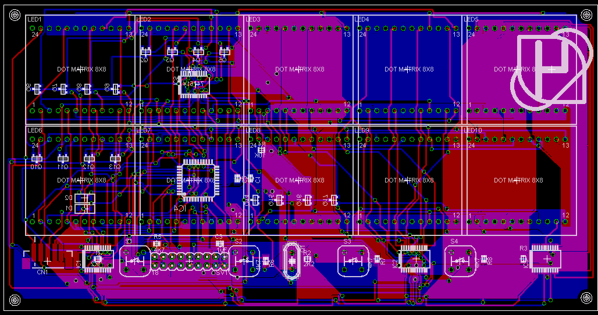

.. rstblog-settings::
   :title: Resurrecting the Dot Matrix Clock
   :date: 2009/04/15
   :url: /2009/04/15/resurrecting-the-dot-matrix-clock

Man, I have been working on this project since probably 2006.  This is by far my longest lived project with about 4 different breadboarded prototypes, 2 or 3 different control schemes, 2 differnt types of displays, and 3 different microcontrollers designed for. I think I have settled on a final design and I do have to say that this clock is more like a computer than an actual clock.

Background
----------

A few years back I saw a POV clock made using a PIC16F84 which I thought was pretty cool. The only drawback that I saw at the time was the fact that it depended on moving parts that made noise. I really wanted to make something like that, so I looked into Dot Matrix displays. At first they seemed really expensive and difficult to get, but I eventually learned that surplus sites and eBay had very cheap displays that I could get. I proposed the idea to my mom to see if she would pay for it and she agreed (to a reasonable limit). I expected the project to take 6 months to a year. I was  dead wrong. Getting a display to even be bright enough to see was a challange on its own, but eventually I learned enough about how to push LEDs to their limits that I could get a visible display running. Originally I used LPT747R displays, but these turned out to be too dim and even after pumping 18V through my 5V logic (resulting in the literal explosion of a hex inverter, but no damage to any of the other parts strangely) they were still barely visible under normal lighting. I discovered that even though LEDs may seem bright when powered constantly they are dimmed to about 1/16 of their original brightness when ran multiplexed. An added bonus of this is that you can pump about 16 times the amount of rated current through an LED (this reduces the LED life though...and if your display freezes those pixels are shot). The other brightness limiting factor is the maximum current driving capacity of the chips used to supply the current and to sink the current. Using standard 74HC logic didn't work very well since they simply couldn't supply enough current (this is probably why 18V didn't blow up the LEDs...not enough current). It took a while, but I have been able to figure out how to drive enough current through the displays to get them to be bright enough (more on this later). Recently I switched over to some 8x8 dot matrices which have also increased visibility greatly.

The display uses an array of serial->parrallel shift registers driving (now sinking) the rows with either a multiplexor or mosfet array sinking (now driving) the rows. I now use a combination of a multiplexor and mosfet array to drive the rows. The entire system is controlled by a microcontroller (originally a 16F628A, but now an 18F4550). The microcontroller stores two entire screens in memory and displays one at a time. During the displaying process each row is clocked out to a chain of shift registers and once the entire row is out the registers shift their data out to some latches which turn on specific LEDs. The rows are controlled by the microcontroller in some fashion which has varied depending on the current mockup.

The current hardware
--------------------

The current version of the Dot Matrix clock consists of two main boards\: The display board and the controller board. As of this writing I have only completed the PCB layouts on the display board. An 18 pin connector connects the two board. Each board has a microcontroller on it with the display board having a PIC18F4550 and the controller board having either another 18F4550 or a PIC24HJsomethingorother (I haven't decided yet). The displays are 10 8x8 displays arranged into a 5x2 pattern giving me 40x16 pixels to work with. I plan on having 4 brighness levels possible per pixel, but this depends heavily on the amount of memory I will be able to spare for display buffers on the microcontroller. The displays are column-cathode, row-anode so power is supplied to the rows.

The PCB layout as it stands now (and as it will probably look in the next revision more or less) is displayed below. There is quite a bit of unused space, so it is possible that I will upgrade to a 4 layer board and just put the entire clock on one board.

 

   Layout as it stands now

 

 

Row driving
~~~~~~~~~~~

Row driving is accomplished by using a 4->16 multiplexor switching 16 mosfets which drive each row. Each mosfet is rated at something around 200-400mA which should be more than enough to drive 40 LEDs at a 1/16th duty cycle at full current with all of them on. Current limiting is accomplished by the column driving/sinking chips and will be explained next.

Column Driving/Sinking
~~~~~~~~~~~~~~~~~~~~~~

Current capacity was a big problem with my previous designs using the 74HC595 chips for column sinking. The chips could only sink so much current at once and would start limiting it at a certain point. This lead to unequal brighness and low visibility. I found a solution to this on one of the pages at `this <http://members.ziggo.nl/electro1/avr/dotmatrix.htm>`__ site. It showed a demonstration of a display using an MBI5027 shift register to sink columns. This shift register is capable of sinking 50mA per output pin and limits current by use of a set resistor on one of the pins. It also has short/open circuit fault detection. The only problem with this chip is that it isn't very available. The only place I could find it was on this King Fish electronics or something like that. They used UPS for shipping which was a minimum of $10. I was not about to pay $10 shipping for a few $1 chips, so I put out a plea for help on one of the various forums I troll and got a response about this MAX6979 chip from Maxim-Dallas. It does the exact same thing as the MBI5027 and even adds a watchdog so that it blanks the display if serial input stops for over a second (could save my modules if my controller crashes). What's more, it was only $0.26 more than the MBI chip and it was sampleable. I have not yet gotten this chip (I *think* it is in the mail) and I can't wait to try it out.

The shift registers are arranged in a chain and data is entered rightmost pixel first. The previous row's data is displayed even during clocking and isn't replaced until an entire new row is ready.

The Software
------------

As of yet I am not ready to release any of the software for this, but I will give the basics of its operation below. The software is mostly incomplete, but I have most of it thought out.

The Display
~~~~~~~~~~~

I have spent most of my time debugging the software for this. Until I got an oscilloscope this was very slow going and my code was very error prone. Even with an oscilloscope I tend to make mistakes like not blanking the previous row before turning on the next one (causes ghosting) or clocking out the data backwards. So far I have only experimented with going right to left, but as I write it has occured to me that arranging the shift registers in the opposite direction and outputting the data left to right would be easier on my mind (and would avoid having to flip my arrays). In either case, the basic sequence this uses to output a row is as follows\:

#. Clock out the new row with the rightmost bit first

#. Turn off the row currently on off

#. Shift all the new data into the latches on the shift registers

#. Turn on the new row and repeat step 1 with the next row keeping this row turned on during step 1

Switching steps 3 and 4 causes slight ghosting and that was probably one of my larger mistakes when I was first writing the code a while back. The rows are stored as two arrays of 40 16-bit words using a row mask. Only one array is actually displayed at any given time and the array that is not being constructed with graphics data is being displayed. After the graphics array is constructed the active array switches and the opposite array is writen to. This prevents screen flicker, makes animation smoother, and allows for a constant framerate without fear of interrupting a write and getting something funky displayed for a frame or so. This is a commonly used technique that I first learned when programming BASIC with I was about 10 or so and applying it to this is not difficult as long as I have the memory.

Adding "color" to the pixels is one of the possible features of this. Instead of having each array be 40 16-bit words it will have 40 32-bit words. This doubles the memory requirement and starts to approach the memory limit of the 18F4550 (remember there are two arrays). The row displaying sequence will be quadrupled so that instead of displaying 16 rows it effectively displays 64 rows, 4 for each actual row. This shouldn't reduce the overall brightness of the screen since all it does it add PWM to each individual row with 2-bit resolution giving 4 "colors".

Data will be written to the display using an 8-bit master-slave parallel bus between the display board and the clock board. I have not yet come up with a control sequence, but the basic functionality will be like the Parellel Slave Port that I have seen on a few higher end microcontrollers. I am leaning toward something along the lines of the following for a control sequence\:

#. Master sends commands that specify where to start writing data and how much data will be written

#. Master enters data mode and writes raw data to the bus. The address pointer is incremented with each byte sent

#. After the specified number of data bytes the slave enters back into control mode

#. The master can either issue more writing commands or send a "refresh" command that will switch which array is written to and display whatever data it has just written.

The program is going to be interrupt driven with the row displaying on a timer so that the framerate is constant. Switching arrays will only happen after an entire frame has been displayed, so there will have be a few flags between the bus "process" and the display "process" to facilitate this. Hopefully the controller won't be overwhelmed, but I plan on running at the full 12MIPS using the fastest crystal possible and the PLL. 

Obviously, most of this code is not yet written but I do have a good idea of what I have to write and after getting a hardware prototype working it sould be relatively easy to put this code in.

The Clock iteself
~~~~~~~~~~~~~~~~~

I haven't even started writing the software for this, but it will be probably even more complex than the display software. I plan on using one of the 24HJ series of PIC microcontrollers to handle this to try and process as much as possible. Some features that this clock will definately have and I have already figured out are as follows\:

* Timekeeping using a RTC with a supercap as a backup power supply

* Multiple alarms (maybe up to 32 or so?)

* Number changing animations

* Menu system

Other possible features that I could add given enough time\:

* Multiple fonts for numbers

* Use an SD card with uncompressed WAV files on it to get alarm "ringtones" (I have done something like this before, but never using an SD card or actual WAV files...only arrays of numbers)

Outlandish features that could only be added if my current programming experience is significantly increased\:

* Get and read RSS feeds using wifi

* Sync a calandar with a computer wirelessly

* Who knows...

Conclusion
----------

As always, do not take my ideas without asking me first or crediting me somehow. Feel free to use this as a resource for your own projects, but if I see an exact duplicate of my clock out there somewhere that I didn't know about previously it could be bad. The point of this clock is to be unique, so if you end up making a clock based off of information you found here then try to make it unique enough so that it could be distinguished from mine easily.

I am not sure how often I will be able to actually work on this clock, but I will post updates when I reach milestones and such.