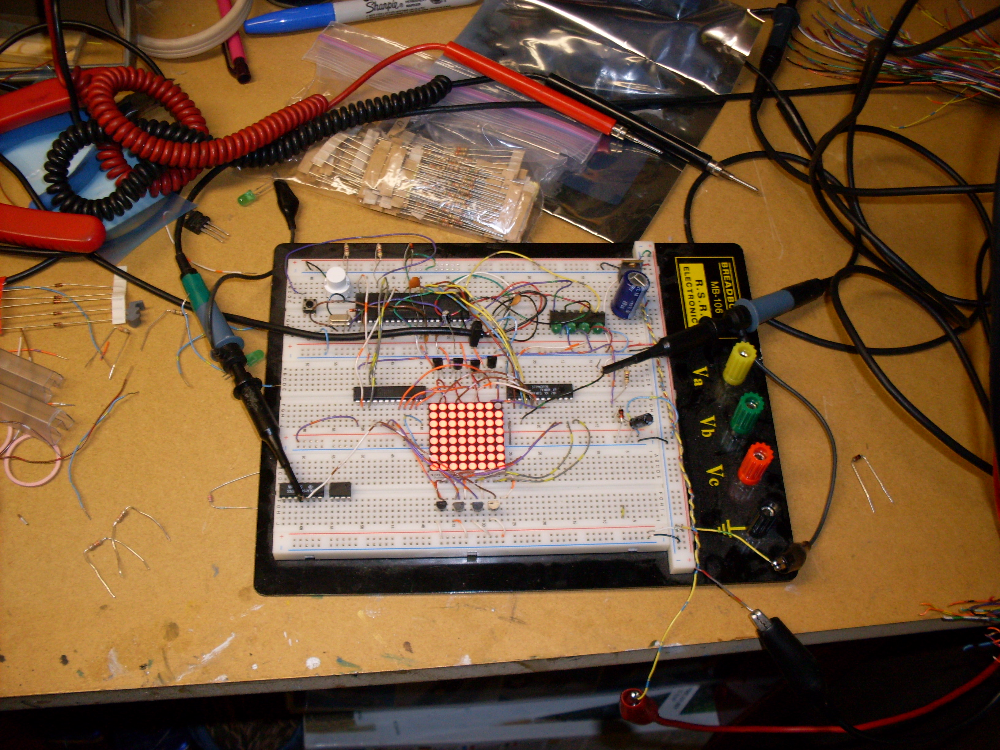

.. rstblog-settings::
   :title: Eureka! The Dot Matrix Displays Work!
   :date: 2009/05/29
   :url: /2009/05/29/eureka-the-dot-matrix-displays-work

   Running one display block with pixel 0,0 turned off

I have finally managed to get a dot matrix display running full bore without resorting to outrageous voltages such as 18V on 5V logic. I have been working towards this moment for probably 2 or 3 years now.

This uses a pinned version of the hardware described in previous posts and more or less proves that it will work with that hardware with few modifications. The only major difference is that I am not using the same chip for the LED current sink. In the picture on the right it is running at an input voltage of 6.37V@325mA which is regulated down to 5.26V and 4.78V.

One major deviation from the hardware mentioned previously is that the row decoder is running at a slightly higher voltage than the rest of the circuit (5.26V). This is to remedy a problem I noticed with the MOSFETs in which their gates are not fully turned on unless the gate voltage is above the drain voltage. What I ended up doing was running a 5.1V zener off of the input from my power supply to create a higher voltage than the 7805 supplies to the rest of the circuit (including the MOSFETs). This is marvelously ineffecient and seems to be causing the 7805 to heat up, but that also might be from the problem that I will go over next.

The other major deviation is how I am running the column sink driver. I ordered one that I *thought* was almost the exact same as the one I planned to use on the PCB, but doesn't behave like the datasheet says it should. I ended up having to take away the external resistor and replace it with a direct short to ground. This effectively removed the current cap and now the chip is drawing 120mA by itself (which is bad). In contrast, the chip draws 20mA with a 300Ω resistor, but half of the rows get turned off. This in itself makes no sense since this is the *column* sink and for something like this to happen it would have to have something to do with the row drivers (i.e. the MOSFETs and accompanying logic), but it consistently shows up when I put a resistor on the resistor pin of the column sink chip. However, if a row starts flickering irregularly all I have to do is increase the input voltage a bit and it goes away. Any ideas as to why this would happen are appreciated (leave a comment).

From a coding standpoint I think I grossly overestimated how hard it would be to strobe this display. The chip is running at 12MIPS and so far is able to render an entire 40x16 buffer at 30fps with a ton of idle time. I have not yet implemented the grayscale dimming functionality, but even that won't add much to the overhead. Looking at my scope I can see that out of the 584uS between rows only ~290uS is actually used for writing to the column sink and switching which row is turned on. This means that my "processor usage" slightly less than 50%. I was expecting it to be significantly more, but now I see that implementing the 8-bit parallel bus which will be the link between this and the "computer" board will be easier than I'd hoped.