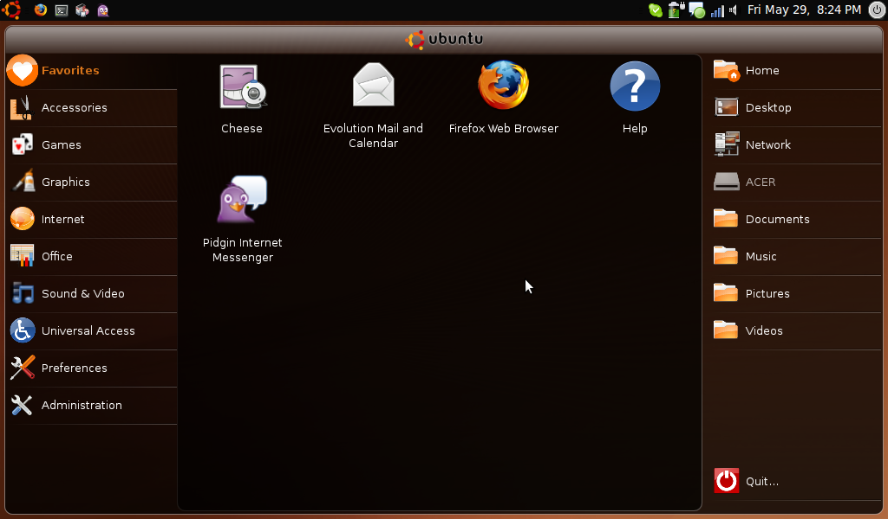

.. rstblog-settings::
   :title: Ubuntu 9.04
   :date: 2009/06/04
   :url: /2009/06/04/ubuntu-904
   :tags: linux

I have just installed Ubuntu 9.04 Netbook Remix on my Acer Aspire One and I have to say it is pretty awesome. First of all, it really does boot in 30 seconds. It took 28 seconds to get to the login screen which is most of the booting. From there it was just the normal login stuff, so it was very fast. Secondly, the Suspend/Resume is also very fast. Fast fast fast. That seems to be the point of this distro. Anyway, I'm definitely keeping this one on my computer.

   Ubuntu 9.04 Netbook Remix

