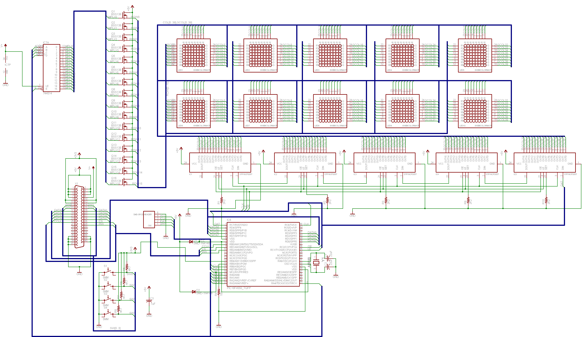

Following the suggestion of a friend, I am going to open source a portion of the software (when it comes) and the display schematic. After I get the board and finish up the software I plan on releasing this as a kit. So far it is looking like the kit is going to cost somewhere between $110-$140. I would supply the board with the controller already soldered and programmed.

As it stands, the hardware features are as follows\:

* 40x16 display with two LEDs per pixel giving 1280 LEDs

* Constant Current LED sink chips to prevent varying brightness problems with the display.

* PIC18F4550 Microcontroller running off the PLL on a 16Mhz oscillator giving 12MIPS throughput

* 41-pin high density board to board connector. A breakout board is included since development without one would be nearly impossible.

* 4 buttons. These are not connected to the display microcontroller, but can be read through the board to board connector.

* 8-bit parallel bus with CS, R/W, and CLK pins for communicating with the microcontroller in the fastest way possible. I have not yet decided on a maximum clock speed, but the clock is on an interrupt enabled pin.

The planned basic software features are as follows\:

* Built in font(s). These would not be restricted by rows or columns and would be placeable by specifying start coordinates. I may also add the ability to have either user fonts and/or variable width characters.

* Pixel-by-pixel control of graphics. Each dot has 16 possible colors (4 brightness levels per color in each pixel...two colors). This would also allow direct memory "dumps" into the display for the possibility of animated things (assuming you have a powerful enough processor on the master side of the bus).

* Triple buffering to prevent overwriting the buffer currently being displayed. This may be extended to allow animations by switching buffers, but I am not sure if I have enough memory yet.

* At least 15fps throughput. 30fps is my target.

* Bootloadable using only bus commands, no POR required. I may or may not make the bootloader protocol public, but I am leaning toward making it public.

* More to come if I accomplish these and still have some clock ticks left over...

As for the board gerbers, I am going to keep them to myself. I spent nearly a year on the board design and I think I need to have at least some profit come of it before I release it to the world for some crazy board outsourcer to steal and clone at half the price I managed to get it fabbed at. I'll tell you this much\: Eagle's autorouter can't handle the entire thing and there are well over 300 nets (not airwires...nets), so good luck.

Now for the schematic. Here you go\:

   Dot Matrix Display Schematic v. 3.5

Now, before someone goes on yelling about how much the BSS138 sucks as a MOSFET I guess I should say that I have replaced it with a much better one that can actually source the current I need it to. The BSS138 has a couple ohms of Rds\ :sub:`On`\ , so I replaced it with a MOSFET that has around 0.25Ω Rds\ :sub:`On`\ . Enjoy.

.. rstblog-settings::
   :title: Dot Matrix Clock: Open sourcing the display schematic
   :date: 2009/09/09
   :url: /2009/09/09/dot-matrix-clock-open-sourcing-the-display-schematic