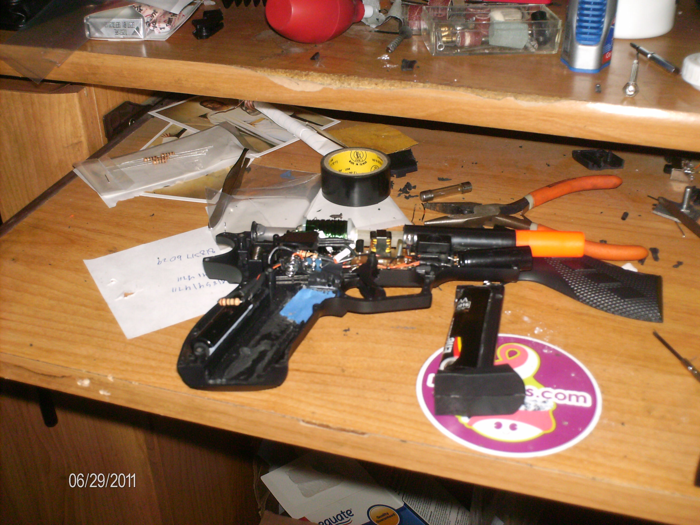
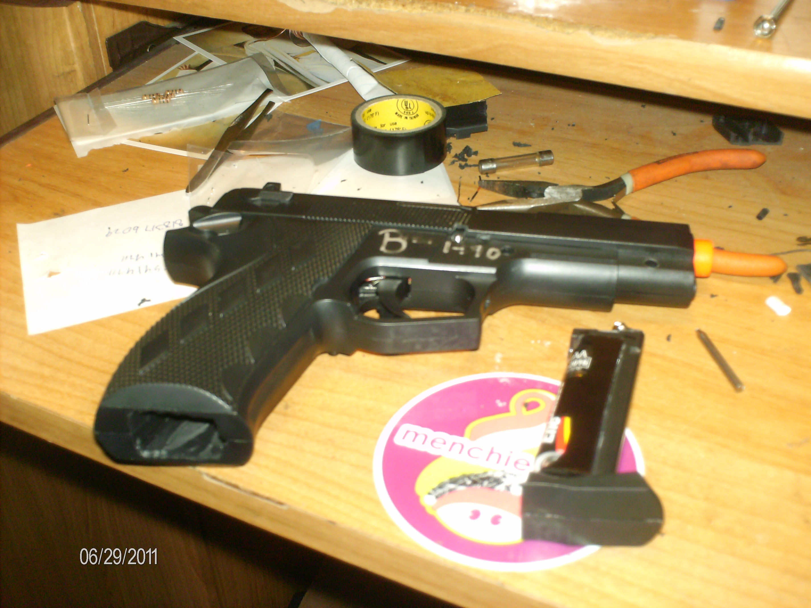
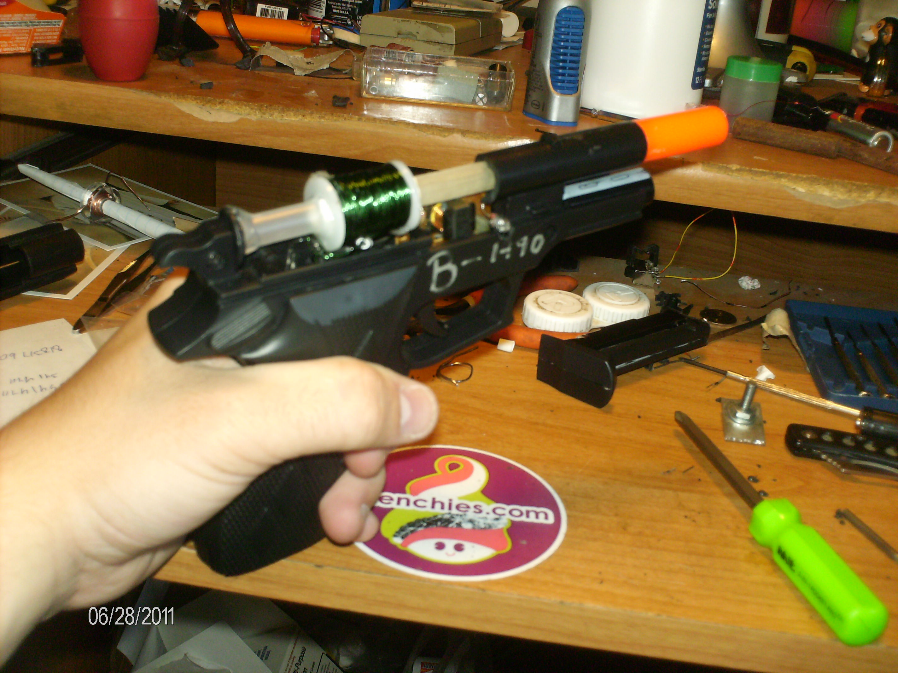
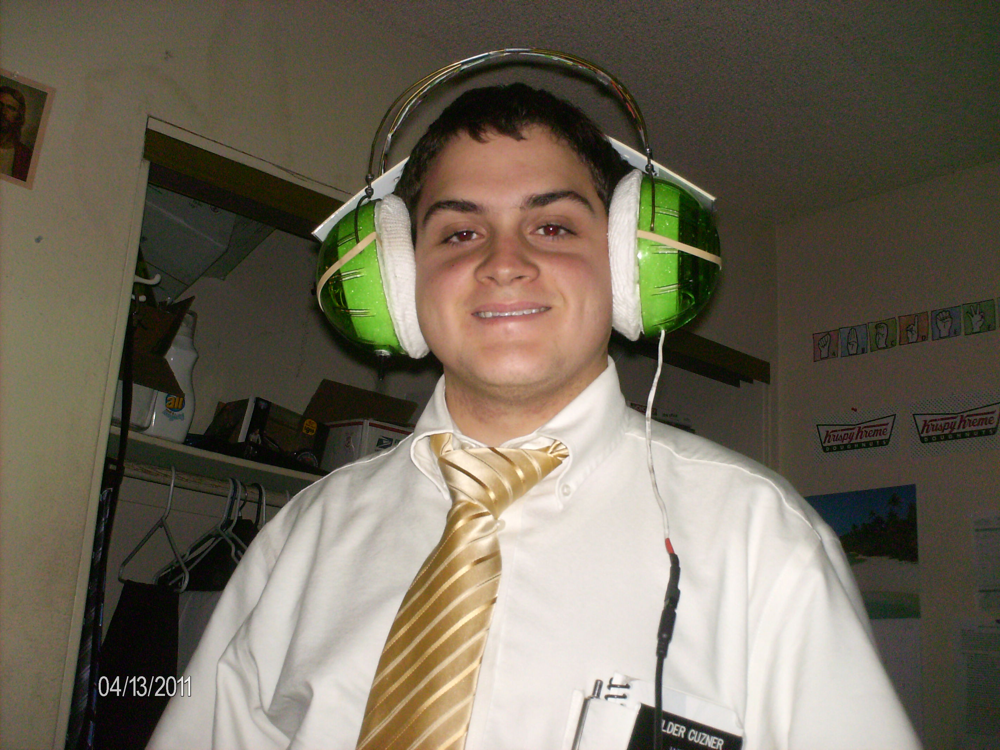
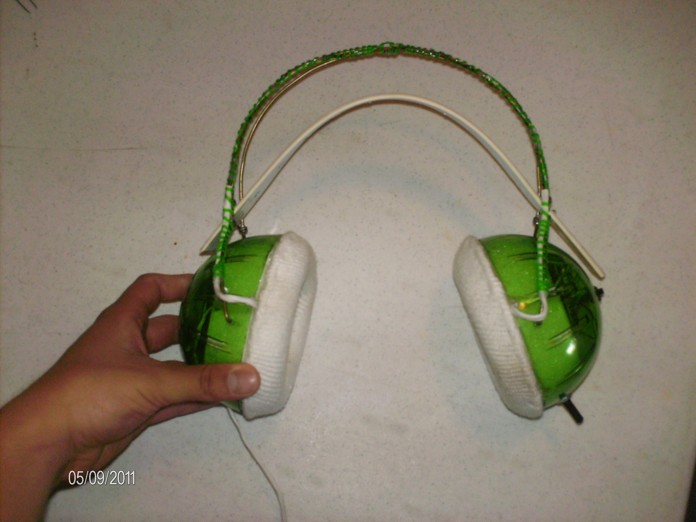

 

After serving a two year mission for my church, I have returned! While on my mission I didn't have much chance to work on my various projects, but I sure thought a lot and wrote down a lot. I also managed to build some pretty interesting things (OK...maybe not that interesting).

On the mission, my two most interesting things I built were a small coilgun (also called a gauss gun) and some large headphones for a deaf lady. I had the most fun with the coilgun since it required the most effort on my part to create. It is housed in the case of a broken airsoft gun and is powered by a camera flash charger and two camera flash capacitors.

**The Coilgun**

   The Coilgun without it's case

The coilgun is constructed of a relatively simple circuit which draws power for a camera flash charger from a AA battery (housed in what was the magazine for the airsoft gun) connected to two photo flash capacitors. There is an SCR connected in series with the coil (the green thing) which use the capacitors as a power source. The trigger uses very tiny snap action limit switch (it was the smallest I could find at a reasonable price) to trigger the SCR (through a 20K resistor). The total cost for parts was $10 since the case was free and the camera flashes were free. The working voltage is about 330V or so which is normal for photo chargers, but when building it I managed only to shock myself once.

   Coilgun with the case screwed on

It shoots nails or anything else magnetic cut to a specific length so they are just a little inside the coil. The gun doesn't have much power (I would more call it a "nail tosser" than a gun), but it is fun to use because of the high pitched charging sound makes the gun sound bigger than it actually is (more bark than bite you could say).

   Coilgun with the coil exposed

There is a 1000V diode in reverse across the coil to prevent damage to the SCR and also a 1MΩ resistor across the capacitors so that they don't retain charge for years and shock some unsuspecting person wondering what is inside this strange looking gun. I have had great fun with this project and someday I hope to build a much larger multi-stage one. Of course, lack of funds will keep that one out of reach for a little while at least, but it is something to work towards.

**The Headphones**

   The Headphones with the ear pads rubber banded on

In one of the apartments I lived in I was with some other missionaries who served a deaf congregation. Their ASL teacher was mostly deaf (she had 1% hearing in one of  her ears) and so she could listen to music occasionally. She was using some high quality DJ headphones to do this since she had to turn the music up really really loud for her to be able to hear it. Sadly, she let a friend borrow them and they got broken. So, one of the other missionaries who also enjoyed building things volunteered him and myself to construct new headphones for her. He built the case and I did the electronics. Electronically, it was a simple project since it was just taking a cheap iPod stereo and extending the wires out to fit into the case in the shape of headphones.

   The completed headphones

The basic design was to use a hamster ball cut in half with coat wire bridging the two speakers. Socks sewed onto cardboard with a cotton filling would be used for the ear pads. An old belt would serve as a size adjuster. The headphones actually turned out pretty nice and were very loud and had pretty good sound quality considering that they were made out of a really cheap iPod speaker set. The only problem was that when they were turned up high the quality would drop dramatically due to clipping/overloading/whatever you call that noise a stereo makes when its turned up to loud. She had to use them at that volume and while she was able to hear the music she asked 'what is that strange noise on top of the music?' and so they ended up being returned and the missionary who built the case bought the cost of the electronics from me and he used the headphones after that.

I have also had many ideas relating to future projects which I will post here when I am ready. Within my first few weeks back I constructed a new computer which should help me out and I hope for it to last at least 5-7 years. I will be posting about that soon as well.

.. rstblog-settings::
   :title: Back again
   :date: 2012/01/07
   :url: /2012/01/07/back-again