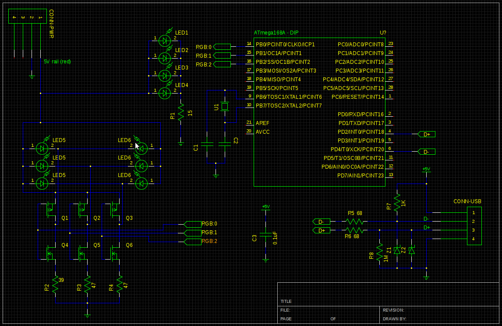
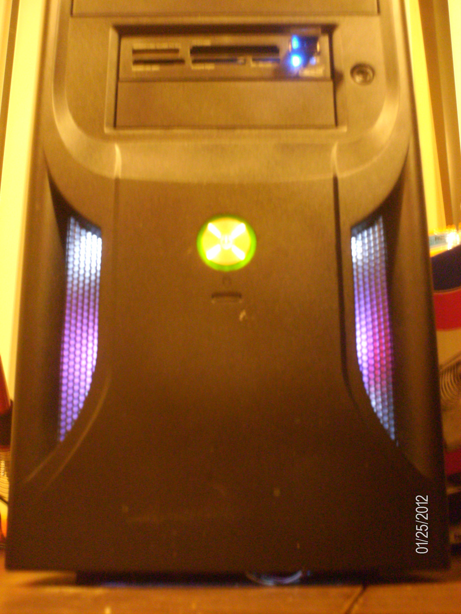
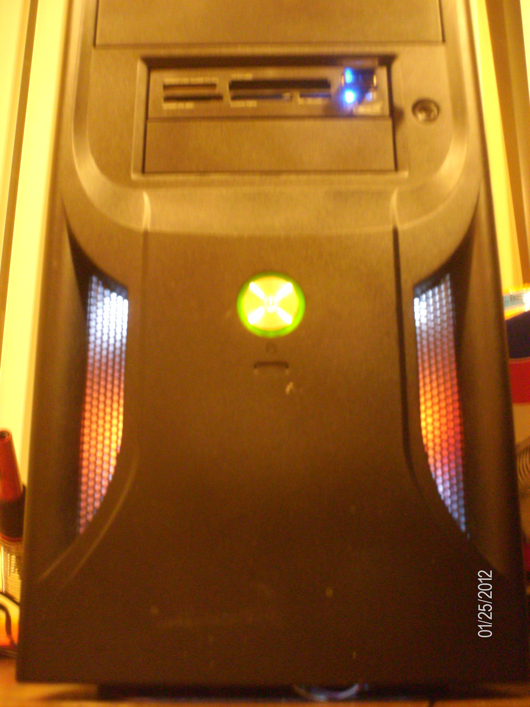
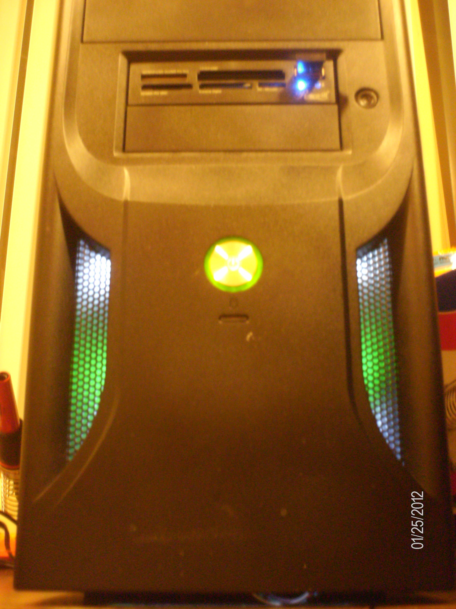
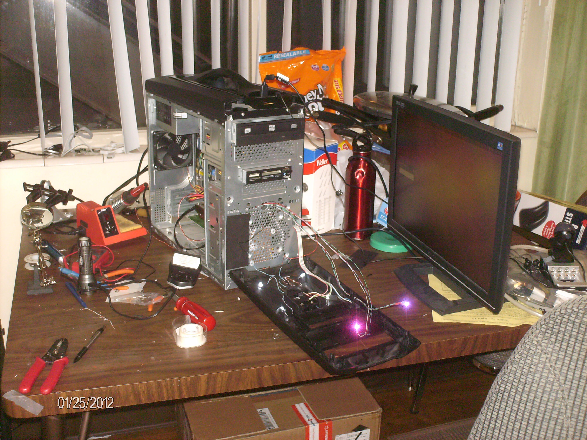
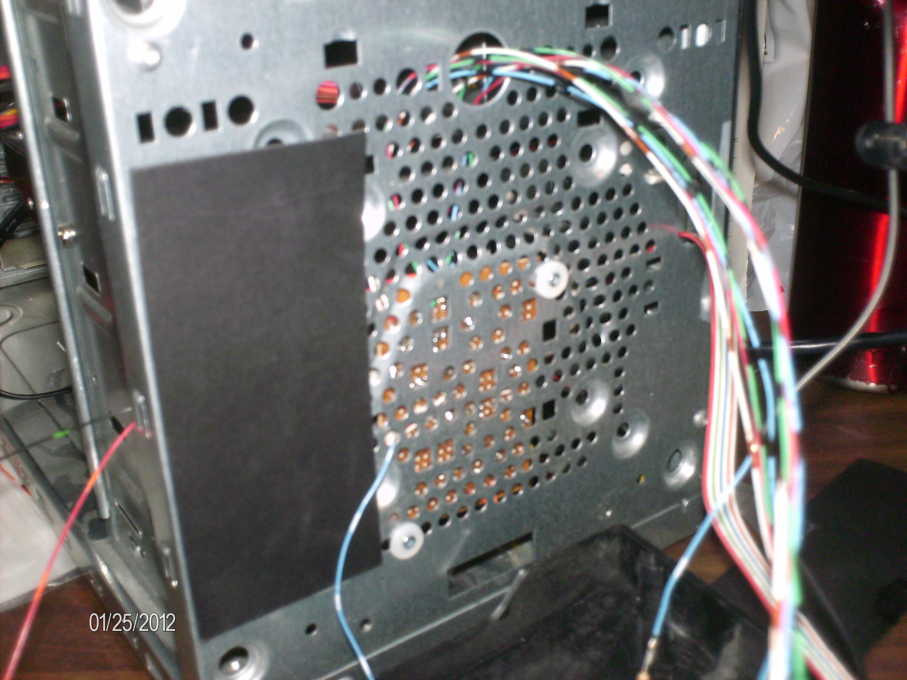
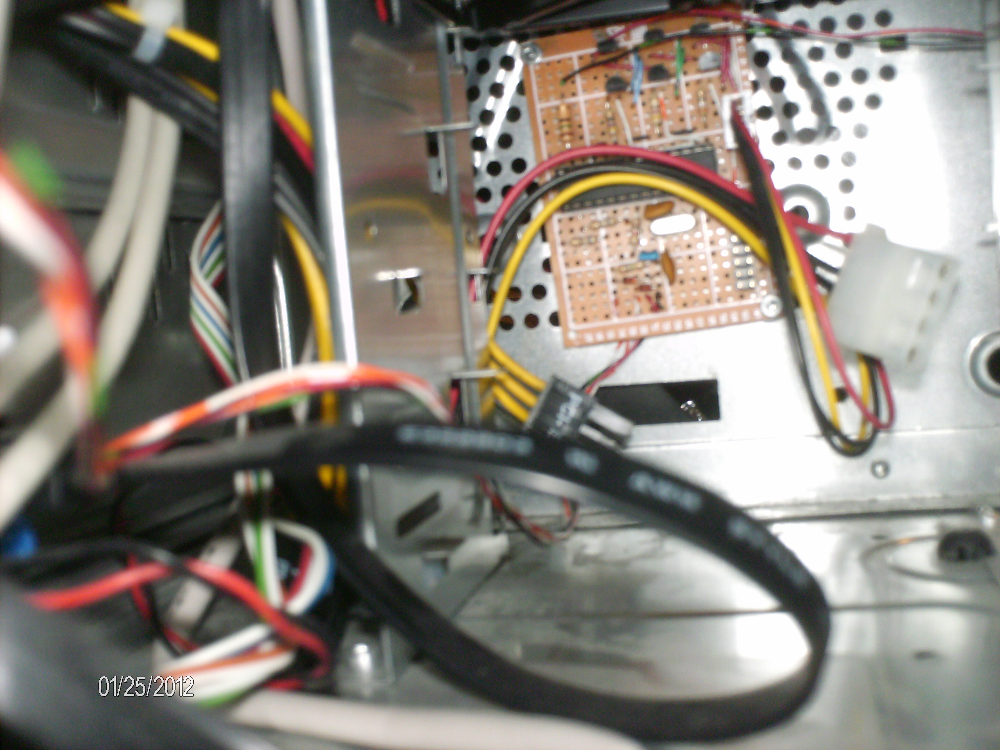

.. rstblog-settings::
   :title: The Case LED v. 2.0: Completed
   :date: 2012/04/23
   :url: /2012/04/23/the-case-led-v-2-0-completed

After much pain and work...(ok, I had a great time; let's be honest now)...I have finished the case LEDs!

Pursuant to the V-USB licence, I am releasing my hardware schematics and the software (which can be found `here <http://cuznersoft.com/wordpress/?p=183>`__). However, it isn't because of the licence that I feel like releasing them...it is because it was quite fun to build and I would recommend it to anyone with a lot of time on their hands. So, to start off let us list the parts\:

* 1 ATMega48A (Digi-key\: ATMEGA48A-PU-ND)

* 1 28 pin socket (Digi-key\: 3M5480-ND)

* 2 3.6V Zener diodes (Digi-key\: 568-5907-1-ND)

* 2 47Ω resistors (Digi-key\: 47QBK-ND)

* 1 39Ω resistor (Digi-key\: 39QTR-ND)

* 1 15Ω resistor (Digi-key\: 15H-ND)

* 3 100V 300mA TO-92 P-Channel MOSFETs (Digi-key\: ZVP2110A-ND)

* 3 2N7000 TO-92 N-Channel MOSFETs (Digi-key\: 2N7000TACT-ND)

* 1 10 Position 2x5, 0.1" pitch connector housing (Digi-key\: WM2522-ND)

* 10 Female terminals for said housing (Digi-key\: WM2510CT-ND)

* 1 4-pin male header, 0.1" pitch for the diskette connector from your power supply (You can find these on digikey pretty easily as well..there are a lot)

* 2 RGB LEDs (Digi-key\: CLVBA-FKA-CAEDH8BBB7A363CT-ND, but you can you whatever you may find)

* 4 White LEDs like in my last case mod

* 1 Prototyping board, 24x17 holes

The schematic is as follows\:

   Schematic (click to open full size)

The parts designations are as follows\:

* R1\: 15Ω

* R2\: 39Ω for the Red channel

* R3\: 47Ω for the Green channel

* R4\: 47Ω for the Blue channel

* LED1-4\: White LEDs of your choosing. Make sure to re-calculate the correct value for R1, taking into account that there are 4 LEDs

* LED5-6\: The RGB LEDs. The resistor values here are based on the part I listed above, so if you decide to change it, re-calculate these values.

* Q1-Q3\: The P-Channel MOSFETs

* Q4-Q6\: The N-Channel MOSFETs

* Z1-Z2\: The zener diodes

* U1\: 16Mhz Crystal

* C1-2\: Capacitors to match the crystal. In my circuit, I think they were 33pF or something

* CONN-PWR\: The 4-pin connector for the diskette

* CONN-USB\: The USB connector. You will have to figure out the wiring for this for your own computer. I used `this <http://www.frontx.com/cpx108_2.html>`__ site for mine. Don't forget to twist the DATA+ and DATA- wires if you aren't using a real USB cable (like me).

* C3\: Very important decoupling capacitor. Place this close to the microcontroller.

As I was building this I did run into a few issues which are easy to solve, but took me some time\:

* If the USB doesn't connect, check the connections, check to make sure the pullups are in the right spot, and check to make sure the DECOUPLING CAPACITOR is there. I got stuck on the decoupling capacitor part, added it, and voila! It connected.

* If the LEDs don't light up, check the connections, then make sure you have it connected to the right power rails. My schematic is a low-side switch since the LEDs I got were common anode. I connected both ends to negative when I first assembled the board and it caused me quite a headache before I realized what I had done

* Double and triple check all the wiring when soldering. It is pain to re-route connections (trust me...I know). Measure twice, cut once.

Although I already have a link above, the software can be found here\: `Case LEDs Software <http://cuznersoft.com/wordpress/?p=183>`__

So, here are pictures of the finished product\:

   LEDs shining magenta

   LEDs shining orange

   LEDs shining green

   With its guts hanging out

   The mounting viewed from the outside

   Mounted onto the front fan grille

