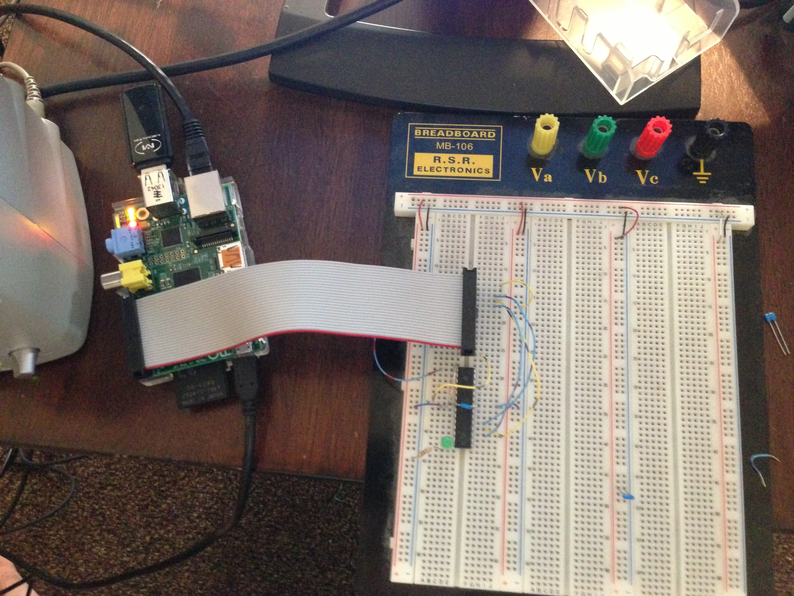

.. rstblog-settings::
   :title: Raspberry Pi as an AVR Programmer
   :date: 2013/05/27
   :url: /2013/05/27/raspberry-pi-as-an-avr-programmer

Introduction
============

Recently, I got my hands on a Raspberry Pi and one of the first things I wanted to do with it was to turn it into my complete AVR development environment. As part of that I wanted to make avrdude be able to program an AVR directly from the Raspberry Pi with no programmer. I know there is this linuxgpio programmer type that was recently added, but it is so recent that it isn't yet included in the repos and it also requires a compile-time option to enable it. I noticed that the Raspberry Pi happens to expose its SPI interface on its expansion header and so I thought to myself, "Why not use this thing instead of bitbanging GPIOs? Wouldn't that be more efficient?" Thus, I began to decipher the avrdude code and write my addition. My hope is that things like this will allow the Raspberry Pi to be used to explore further embedded development for those who want to get into microcontrollers, but blew all their money on the Raspberry Pi. Also, in keeping with the purpose that the Raspberry Pi was originally designed for, using it like this makes it fairly simple for people in educational surroundings to expand into different aspects of small computer and embedded device programming.

As my addition to avrdude, I created a new programmer type called "linuxspi" which uses the userspace SPI drivers available since around Linux ~2.6 or so to talk to a programmer. It also requires an additional GPIO to operate as the reset. My initial thought was to use the chip select as the reset output, but sadly, the documentation for the SPI functions mentioned that the chip enable line is only held low so long as the transaction is going. While I guess I could compress all the transactions avrdude makes into one giant burst of data, this would be very error prone and isn't compatible with avrdude's program structure. So, the GPIO route was chosen. It just uses the sysfs endpoints found in /sys/class/gpio to manipulate a GPIO chosen in avrdude.conf into either being in a hi-z input state or an output low state. This way, the reset can be connected via a resistor to Vcc and then the Raspberry Pi just holds reset down when it needs to program the device. Another consequence which I will mention here of choosing to use the Linux SPI drivers is that this should actually be compatible with any Linux-based device that exposes its SPI or has an AVR connected to the SPI; not just the Raspberry Pi.

Usage
=====

So, down to the nitty gritty\: How can I use it? Well, at the moment it is in a github repository at `https\://github.com/kcuzner/avrdude <https://github.com/kcuzner/avrdude>`__. As with any project that uses the expansion header on the Raspberry Pi, there is a risk that a mistake could cause your Raspberry Pi to die (or let out the magic smoke, so to speak). I assume no responsibility for any damage that may occur as a result of following these directions or using my addition to avrdude. Just be careful when doing anything involving hooking stuff up to the expansion port and use common sense. Remember to measure twice and cut once. So, with that out of the way, I will proceed to outline here the basic steps for installation and usage.

Installation
------------

The best option here until I bother creating packages for it is to  do a git clone directly into a directory on the Raspberry Pi and build it from there on the Raspberry Pi itself. I remember having to install the following packages to get it to compile (If I missed any, let me know)\:

* bison

* autoconf

* make

* gcc

* flex

Also, if your system doesn't have a header at "linux/spi/spidev.h" in your path, you probably need to install that driver. I was using Arch Linux and it already had the driver there, so for all I know its always installed. You also should take a look to make sure that "/dev/spidev0.0" and "/dev/spidev0.1" or something like that exist. Those are the sort of endpoints that are to be used with this. If they do not exist, try executing a "sudo modprobe spi_bcm2708". If the endpoints still aren't there after that, then SPI support probably isn't installed or enabled for your kernel.

After cloning the repo and installing those packages, run the "./boostrap" script which is found in the avrdude directory. This will run all the autoconf things and create the build scripts. The next step is to run "./configure" and wait for it to complete. After the configure script, it should say whether or not "linuxspi" is enabled or disabled. If it is disabled, it was not able to find the header I mentioned before. Then run "make" and wait for it to complete. Remember that the Raspberry Pi is a single core ARM processor and so building may take a while. Afterwards, simply do "sudo make install" and you will magically have avrdude installed on your computer in /usr/local. It would probably be worthwhile to note here that you probably want to uninstall any avrdude you may have had installed previously either manually or through a package manager. The one here is built on top of the latest version (as of May 26th, 2013), so it *should* work quite well and be all up to date and stuff for just using it like a normal avrdude. I made no changes to any of the programmer types other than the one I added.

To check to see if the avrdude you have is the right one, you should see an output similar to the following if you run this command (tiny-tim is the name of my Raspberry Pi until I think of something better)\:

.. code-block:: 

   kcuzner@tiny-tim:~/avrdude/avrdude$ avrdude -c ?type

   Valid programmer types are:
     arduino          = Arduino programmer
     avr910           = Serial programmers using protocol described in application note AVR910
     avrftdi          = Interface to the MPSSE Engine of FTDI Chips using libftdi.
     buspirate        = Using the Bus Pirate's SPI interface for programming
     buspirate_bb     = Using the Bus Pirate's bitbang interface for programming
     butterfly        = Atmel Butterfly evaluation board; Atmel AppNotes AVR109, AVR911
     butterfly_mk     = Mikrokopter.de Butterfly
     dragon_dw        = Atmel AVR Dragon in debugWire mode
     dragon_hvsp      = Atmel AVR Dragon in HVSP mode
     dragon_isp       = Atmel AVR Dragon in ISP mode
     dragon_jtag      = Atmel AVR Dragon in JTAG mode
     dragon_pdi       = Atmel AVR Dragon in PDI mode
     dragon_pp        = Atmel AVR Dragon in PP mode
     ftdi_syncbb      = FT245R/FT232R Synchronous BitBangMode Programmer
     jtagmki          = Atmel JTAG ICE mkI
     jtagmkii         = Atmel JTAG ICE mkII
     jtagmkii_avr32   = Atmel JTAG ICE mkII in AVR32 mode
     jtagmkii_dw      = Atmel JTAG ICE mkII in debugWire mode
     jtagmkii_isp     = Atmel JTAG ICE mkII in ISP mode
     jtagmkii_pdi     = Atmel JTAG ICE mkII in PDI mode
     jtagice3         = Atmel JTAGICE3
     jtagice3_pdi     = Atmel JTAGICE3 in PDI mode
     jtagice3_dw      = Atmel JTAGICE3 in debugWire mode
     jtagice3_isp     = Atmel JTAGICE3 in ISP mode
     linuxgpio        = GPIO bitbanging using the Linux sysfs interface (not available)
     linuxspi         = SPI using Linux spidev driver
     par              = Parallel port bitbanging
     pickit2          = Microchip's PICkit2 Programmer
     serbb            = Serial port bitbanging
     stk500           = Atmel STK500 Version 1.x firmware
     stk500generic    = Atmel STK500, autodetect firmware version
     stk500v2         = Atmel STK500 Version 2.x firmware
     stk500hvsp       = Atmel STK500 V2 in high-voltage serial programming mode
     stk500pp         = Atmel STK500 V2 in parallel programming mode
     stk600           = Atmel STK600
     stk600hvsp       = Atmel STK600 in high-voltage serial programming mode
     stk600pp         = Atmel STK600 in parallel programming mode
     usbasp           = USBasp programmer, see http://www.fischl.de/usbasp/
     usbtiny          = Driver for "usbtiny"-type programmers
     wiring           = http://wiring.org.co/, Basically STK500v2 protocol, with some glue to trigger the bootloader.

Note that right under "linuxgpio" there is now a "linuxspi" driver. If it says "(not available)" after the "linuxspi" description, "./configure" was not able to find the "linux/spi/spidev.h" file and did not compile the linuxspi programmer into avrdude.

Configuration
-------------

There is a little bit of configuration that happens here on the Raspberry Pi side before proceeding to wiring it up. You must now decide which GPIO to sacrifice to be the reset pin. I chose 25 because it is next to the normal chip enable pins, but it doesn't matter which you choose. To change which pin is to be used, you need to edit "/usr/local/etc/avrdude.conf" (it will be just "/etc/avrdude.conf" if it wasn't built and installed manually like above). Find the section of the file that looks like so\:

.. code-block:: 

   programmer
     id = "linuxspi";
     desc = "Use Linux SPI device in /dev/spidev*";
     type = "linuxspi";
     reset = 25;
   ;

The "reset = " line needs to be changed to have the number of the GPIO that you have decided to turn into the reset pin for the programmer. The default is 25, but that's just because of my selfishness in not wanting to set it to something more generic and having to then edit the file every time I re-installed avrdude. Perhaps a better default would be "0" since that will cause the programmer to say that it hasn't been set up yet.

Wiring
------

After setting up avrdude.conf to your desired configuration, you can now connect the appropriate wires from your Raspberry Pi's header to your microchip. **A word of extreme caution\:** **The Raspberry Pi's GPIOs are NOT 5V tolerant, and that includes the SPI pins** . You must do either one of two things\: a) Run the AVR and everything around it at 3.3V so that you never see 5V on ANY of the Raspberry Pi pins at any time (including after programming is completed and the device is running) or b) Use a level translator between the AVR and the SPI. I happen to have a level translator lying around (its a fun little TSSOP I soldered to a breakout board a few years back), but I decided to go the 3.3V route since I was trying to get this thing to work. If you have not ever had to hook up in-circuit serial programming to your AVR before, perhaps this would be a great time to learn. You need to consult the datasheet for your AVR and find the pins named RESET (bar above it), MOSI, MISO, and SCK. These 4 pins are connected so that RESET goes to your GPIO with a pullup resistor to the Vcc on your AVR, MOSI goes to the similarly named MOSI on the Raspberry Pi header, MISO goes to the like-named pin on the header, and SCK goes to the SPI clock pin (named SCLK on the diagram on elinux.org). After doing this and **double checking to make sure 5V will never be present to the Raspberry Pi** , you can power on your AVR and it should be able to be programmed through avrdude. Here is a demonstration of me loading a simple test program I made that flashes the PORTD LEDs\:

.. code-block:: 

   kcuzner@tiny-tim:~/avrdude/avrdude$ sudo avrdude -c linuxspi -p m48 -P /dev/spidev0.0 -U flash:w:../blink.hex 
   [sudo] password for kcuzner: 

   avrdude: AVR device initialized and ready to accept instructions

   Reading | ################################################## | 100% 0.00s

   avrdude: Device signature = 0x1e9205
   avrdude: NOTE: "flash" memory has been specified, an erase cycle will be performed
            To disable this feature, specify the -D option.
   avrdude: erasing chip
   avrdude: reading input file "../blink.hex"
   avrdude: input file ../blink.hex auto detected as Intel Hex
   avrdude: writing flash (2282 bytes):

   Writing | ################################################## | 100% 0.75s

   avrdude: 2282 bytes of flash written
   avrdude: verifying flash memory against ../blink.hex:
   avrdude: load data flash data from input file ../blink.hex:
   avrdude: input file ../blink.hex auto detected as Intel Hex
   avrdude: input file ../blink.hex contains 2282 bytes
   avrdude: reading on-chip flash data:

   Reading | ################################################## | 100% 0.56s

   avrdude: verifying ...
   avrdude: 2282 bytes of flash verified

   avrdude: safemode: Fuses OK

   avrdude done.  Thank you.

There are two major things to note here\:

* I set the programmer type (-c option) to be "linuxspi". This tells avrdude to use my addition as the programming interface

* I set the port (-P option) to be "/dev/spidev0.0". On my Raspberry Pi, this maps to the SPI bus using CE0 as the chip select. Although we don't actually use CE0 to connect to the AVR, it still gets used by the spidev interface and will toggle several times during normal avrdude operation. Your exact configuration may end up being different, but this is more or less how the SPI should be set. If the thing you point to isn't an SPI device, avrdude should fail with a bunch of messages saying that it couldn't send an SPI message.

Other than that, usage is pretty straightforward and should be the same as if you were using any other programmer type.

Future
======

As issues crop up, I hope to add improvements like changing the clock frequency and maybe someday adding TPI support (not sure if necessary since this is using the dedicated SPI and as far as I know, TPI doesn't use SPI).

I hope that those using this can find it helpful in their fun and games with the Raspberry Pi. If there are any issues compiling and stuff, either open an issue on github or mention it in the comments here.