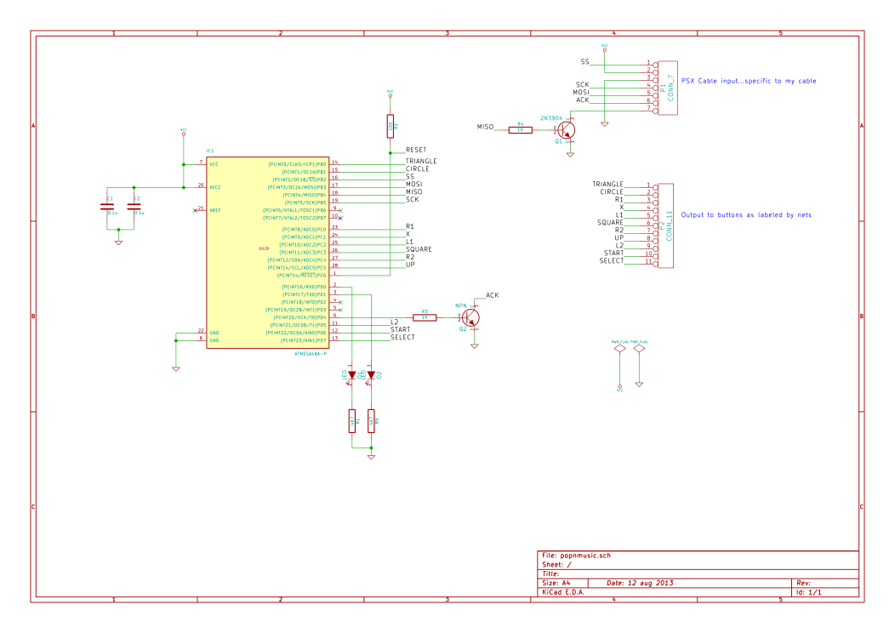
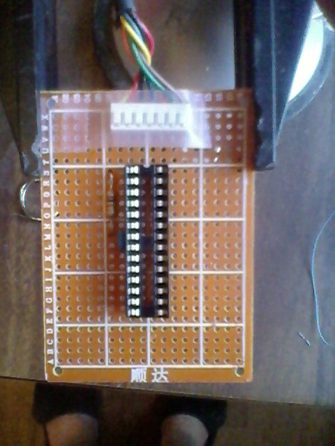
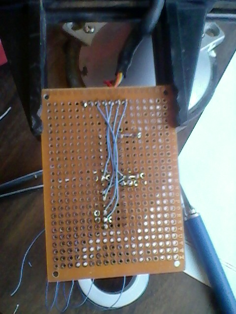
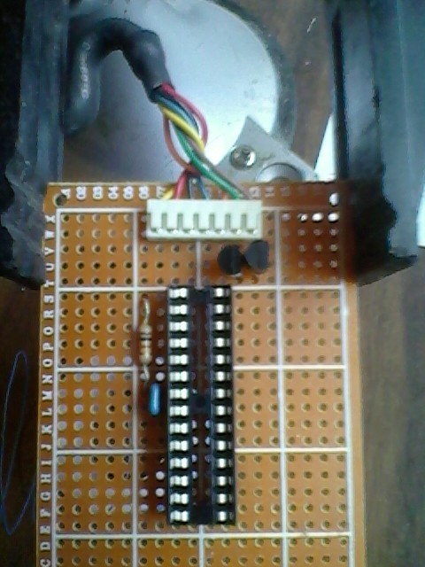
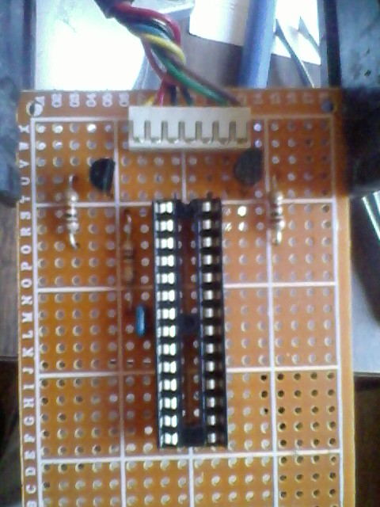
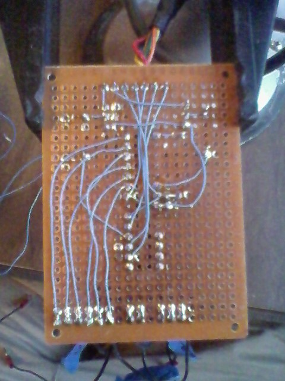
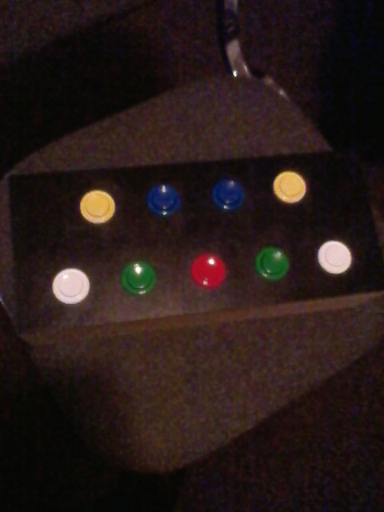
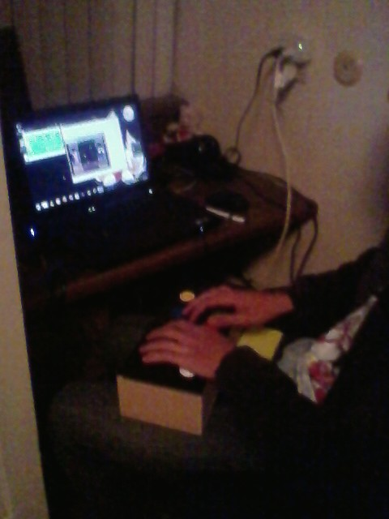

Every time I do one of these bus emulation projects, I tell myself that the next time I do it I will use an oscilloscope or DLA. However, I never actually break down and just buy one. Once more, I have done a bus emulation project flying blind. This is the harrowing tale\:

Code & Schematics (kicad)\: `https\://github.com/kcuzner/pop-n-music-controller <https://github.com/kcuzner/pop-n-music-controller>`__

Introduction
============

A couple of days ago, I was asked to help do some soldering for a modification someone was trying to do to a PS1 controller. He informed me that it was for the game `Pop 'n Music <https://en.wikipedia.org/wiki/Pop'n_Music>`__ and that it required a special controller to be played properly. Apparently, official controllers can sell for $100 or more, so modifying an existing controller was the logical thing to do. After much work and pain, it was found that while modifying an existing controller was easy, it wasn't very robust and could easily fall apart and so I built one using an ATMega48 and some extra components I had lying around. The microcontroller emulates the PSX bus which is used to communicate between the controller and the playstation/computer. As my reference for the bus, I used the following two web pages\:

* `http\://emu-docs.org/PlayStation/psxcont/ <http://emu-docs.org/PlayStation/psxcont/>`__ - Schematics and details on the electrical properties of the bus

* `http\://store.curiousinventor.com/guides/PS2/ <http://store.curiousinventor.com/guides/PS2/>`__ - Really good list of commands that the playstation asks of the controller and how to respond. More accurate that the previous site when talking about the commands.

The complete schematics and software can be found on `my github <https://github.com/kcuzner/pop-n-music-controller>`__.

The first attempt\: Controller mod
==================================

The concept behind the controller mod was simple\: Run wires from the existing button pads to some arcade-style buttons arranged in the pattern needed for the controller. It worked well at first, but after a little while we began to have problems\:

* The style of pad that he purchased had conductive rubber covering all of the copper for the button landings. In order to solder to this, it was necessary to scrape off the rubber. This introduced a tendency for partially unclean joints, giving rise to cold connections. While with much effort I was able to mitigate this issue (lots of scraping and cleaning), the next problem began to manifest itself.

* The copper layout for each button pad was of a rather minimalist design. While some pads shown online had nice large areas for the button to contact, this particular controller had 50-100 mil lines arranged in a circular pattern rather than one huge land. While I imagine this is either economical or gives better contact, it sure made soldering wires onto it difficult. I would get the wire soldered, only to have it decide that it wanted to come off and take the pad with it later. This was partly due to bad planning on my part and using wire that wasn't flexible enough, but honestly, the pads were not designed to be soldered to.

* With each pad that lifted, the available space for the wires on certain buttons to be attached to began to become smaller and smaller. Some buttons were in the large land style and were very easy to solder to and the joints were strong (mainly the arrow pad buttons). The issue was with the start and select buttons (very narrow) and the X, square, triangle, and O buttons (100mil spiral thing mentioned earlier). Eventually, I was resorting to scraping the solder mask off and using 30awg wire wrapping wire to solder to the traces. It just got ridiculous and wasn't nearly strong enough to hold up as a game controller.

* In order for the controller to be used with a real playstation, rather than an emulator, the Left, Right, and Down buttons had to be pressed at the same time to signify to the game that it was a Pop 'n Music controller. Emulators generally can't handle this sort of behavior when mapping the buttons around, so putting a switch was considered. However, any reliable switch (read\: Nice shiny toggle switch) was around $3. Given the low cost aim of this project, it was becoming more economical to explore other options

So, we began exploring other options. I found `this site <http://emu-docs.org/PlayStation/psxcont/>`__ detailing emulation of these controllers using either 74xx logic or a microcontroller. It is a very good resource, and is mostly correct about the protocol. After looking at the 74xx logic solution and totaling up the cost, I noticed that my $1.75 microcontroller along with the required external components would actually come out to be cheaper than buying 4 chips and sockets for them. Even better, I already had a microcontroller and all the parts on hand, so there was no need for shipping. So, I began building and programming.

AVR PSX Bus Emulation\: The Saga of the Software
================================================

PSX controllers communicate using a bus that has a clock, acknowledge, slave select, psx->controller (command) line, and controller->psx (data) line. Yes, this looks a lot like an SPI bus. In fact, it is more or less identical to a SPI Mode 3 bus with the master-in slave-out line driven open collector. I failed to notice this fact until later, much to my chagrin. Communication is accomplished using packets that have a start signal followed by a command and waiting for a response from the controller. During the transaction, the controller declares its type, the number of words that it is going to send, and the actual controller state. I was emulating a standard digital controller, so I had to tell it that my controller type was 0x41, which is digital with 1 word data. Then, I had to send a 0x5A (start data response byte) and two bytes of button data. My initial approach involved `writing a routine in C <https://github.com/kcuzner/pop-n-music-controller/commit/7a4fef3a08cff20d1e7809010f511c3e9ed235e1>`__ that would handle pin changes on INT0 and INT1 which would be connected to the command and clock lines. However, I failed to anticipate that the bus would be somewhere in the neighborhood of 250Khz-500Khz and this caused some serious performance problems and I was unable to complete a transaction with the controller host. So, I decided to try writing `the same routine in assembly <https://github.com/kcuzner/pop-n-music-controller/commit/51bb37af031981c1c2d462e4d710d83551b1e87e>`__ to see if I could squeeze every drop of performance out of it possible. I managed to actually get it to complete a transaction this way, but *without* sending button data. To make matters worse, every once in a while it would miss a transaction and this was quite noticeable when I made an LED change state with every packet received. It was very inconsistent and that was without even sending button data. I eventually realized the problem was with the fact that making the controller do so much between cycles of the clock line actually caused it to miss bits. So, I looked at the problem again. I noticed that the ATMega48A had an SPI module and that the PSX bus looked similar, but not exactly like, an SPI bus. However, running the bus in mode 3 with the `data order reversed <https://github.com/kcuzner/pop-n-music-controller/commit/023e6b78edc25c215b9ef025fbc60befbddc391e>`__ and the MISO driving the base of a transistor operating in an open-collector fashion actually got me to be able to communicate to the PSX bus on `almost the first try <https://github.com/kcuzner/pop-n-music-controller/commit/4d09663f24c7d2d3c95c2f8aff17db237f88ee8d>`__. Even better, the only software change that had to be made was inverting the data byte so that the signal hitting the base of the transistor would cause the correct changes on the MISO line. So, I hooked up everything as follows\:

After doing that, suddenly I got everything to work. It responded correctly to the computer when asked about its inputs and after some optimization, stopped skipping packets due to taking too much time processing button inputs. It worked! Soon after getting the controller to talk to the computer, I discovered an error in the website I mentioned earlier that detailed the protocol. It mentioned that during transmission of the data about the buttons that the control line was going to be left high. While its a minor difference, I thought I might as well mention `this site <http://store.curiousinventor.com/guides/PS2/>`__, which lists the commands correctly and was very helpful. As I mentioned before, one problem that was encoutered was that in order for the controller to be recognized as a pop-n-music controller by an actual playstation, the left, right, and down buttons must be pressed. However, it seems that the PSX->USB converter that we were using was unable to handle having those 3 pressed down at once. So, there needed to be a mode switch. The way for switching modes I came up with was to hold down both start and select at the same time for 3 seconds. After the delay, the modes would switch. The UI interaction for this is embodied in two LEDs. One LED is lit for when it is in PSX mode and the other when it is in emulator mode. When both buttons are pressed, both LEDs light up until the one for the previous mode shuts off. At first, I had the mode start out every time the controller was started in the same mode, no matter what the previous mode was before it was shut off. It soon became apparent that this wouldn't do, and so I looked in to using the EEPROM to store the flag value I was using to keep the state of the controller. Strangely, `it worked on the first try <https://github.com/kcuzner/pop-n-music-controller/commit/8cb99e07dee7fbaf482ded0405dbf21efbd647a5>`__, so the controller will stay in the same mode from the last time it was shut off. My only fear is that switching the mode too much could degrade the EEPROM. However, the datasheet says that it is good for 100,000 erase/write cycles, so I imagine it would be quite a while before this happens and other parts of the controller will probably fail first (like the switches).

On to the hardware!
===================

I next began assembly. I went the route of perfboard with individual copper pads around each hole because that's what I have. Here are photos of the assembly, sadly taken on my cell phone because my camera is broken. Sorry for the bad quality...

Conclusion
==========

So, with the controller in the box and everything assembled, it seems that all will be well with the controller. It doesn't seem to miss keypresses or freeze and is able to play the game without too many hiccups (the audio makes it difficult, but that's just a emulator tweaking issue). The best part about this project is that in terms of total work time, it probably took only about 16 hours. Considering that most of my projects take months to finish, this easily takes the cake as one of my quickest projects start to finish.

.. rstblog-settings::
   :title: Pop 'n Music controller...AVR style
   :date: 2013/08/17
   :url: /2013/08/17/pop-n-music-controller-avr-style