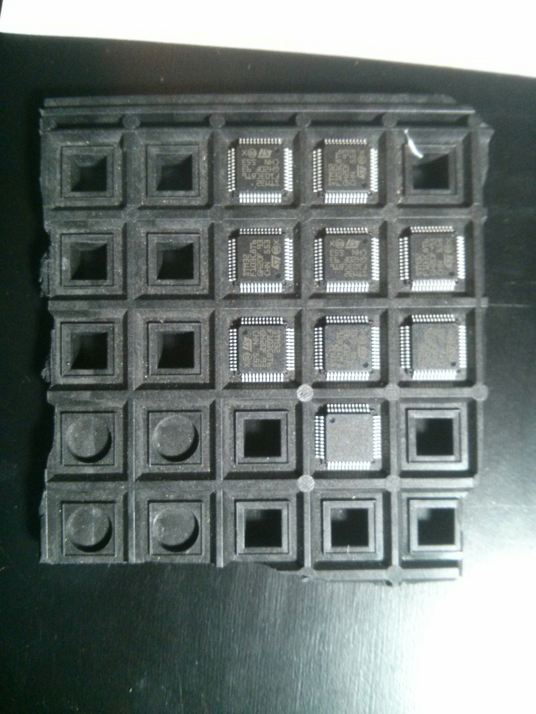
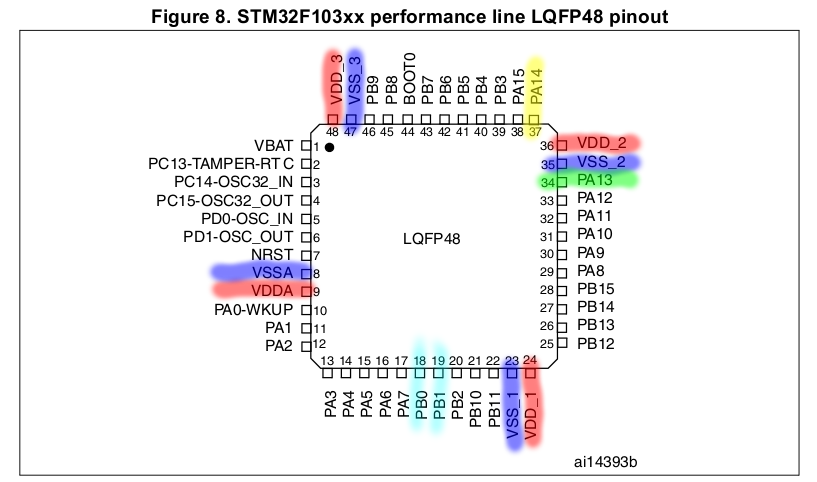
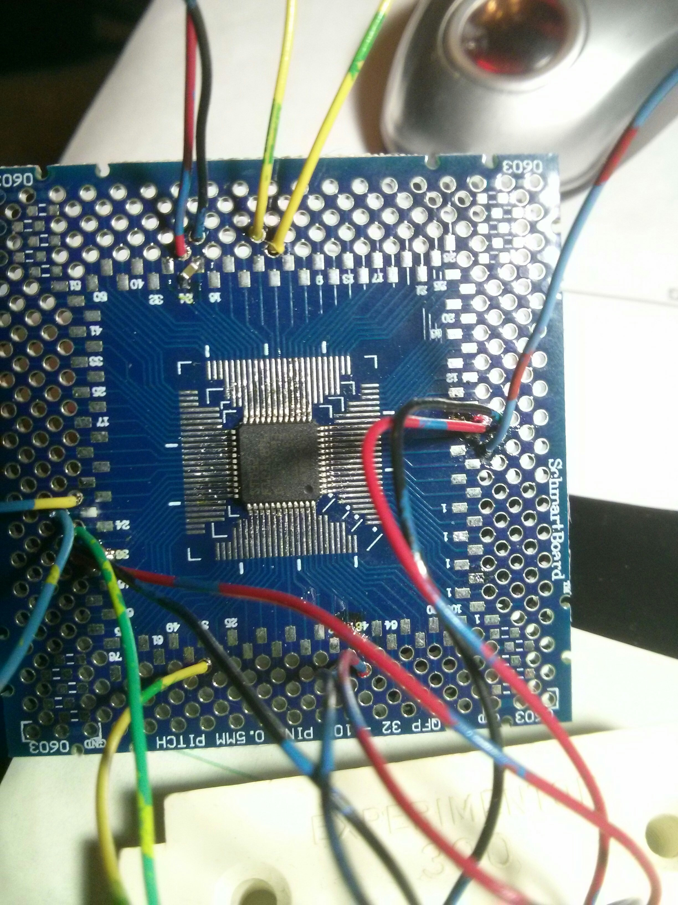
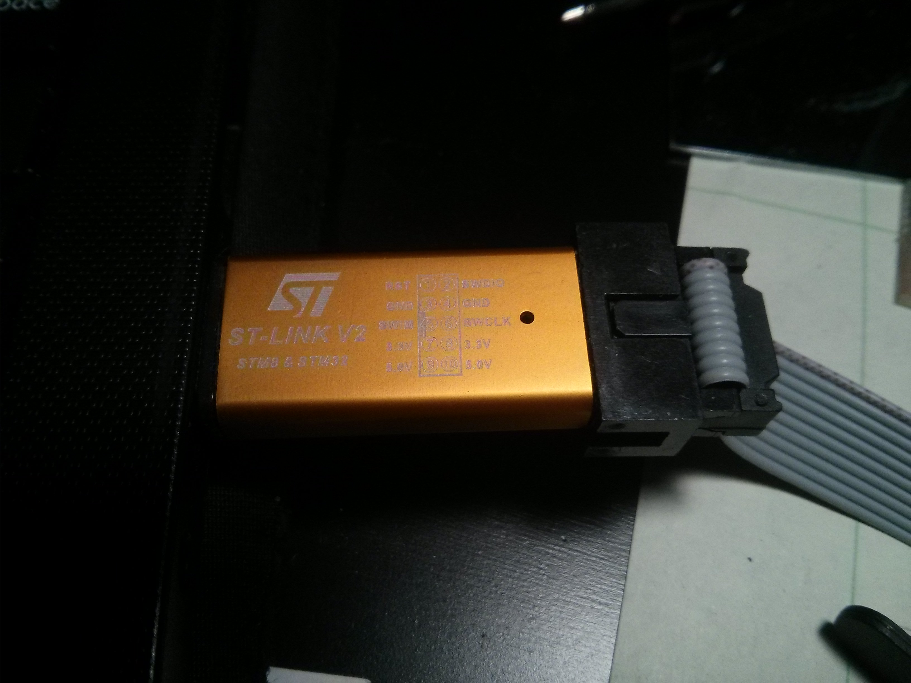
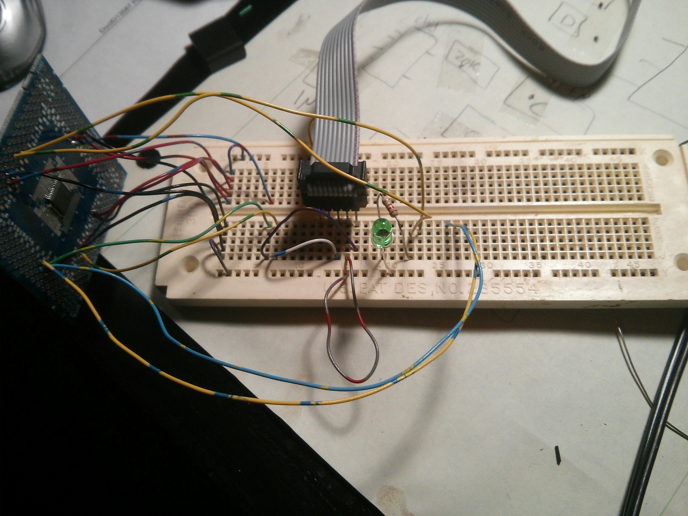
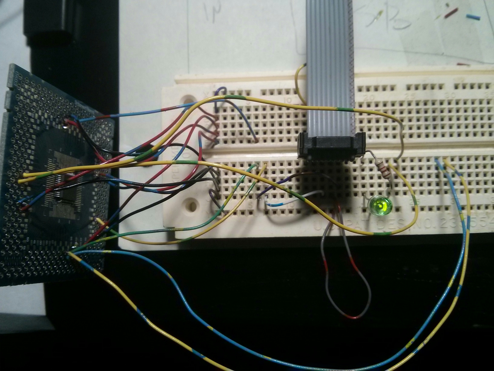

.. rstblog-settings::
   :title: Dev boards? Where we're going we won't need dev boards...
   :date: 2016/05/22
   :url: /2016/05/22/dev-boards-where-were-going-we-wont-need-dev-boards

A complete tutorial for using an STM32 without a dev board
==========================================================

Introduction
------------

About two years ago I started working with the Teensy 3.1 (which uses a Freescale Kinetis ARM-Cortex microcontroller) and I was super impressed with the ARM processor, both for its power and relative simplicity (it is not simple...its just relatively simple for the amount of power you get for the cost IMO). Almost all my projects before that point had consisted of AVRs and PICs (I'm in the AVR camp now), but now ARM-based microcontrollers had become serious contenders for something that I could go to instead. I soon began working on a small development board project also involving some Freescale Kinetis microcontrollers since those are what I have become the most familiar with. Sadly, I have had little success since I have been trying to make a programmer myself (the official one is a minimum of $200). During the course of this project I came across a LOT of STM32 stuff and it seemed that it was actually quite easy to set up. Lots of the projects used the STM32 Discovery and similar dev boards, which are a great tools and provide an easy introduction to ARM microcontrollers. However, my interest is more towards doing very bare metal development. Like soldering the chip to a board and hooking it up to a programmer. Who needs any of that dev board stuff? For some reason I just find doing embedded development without a development board absolutely fascinating. Some people might interpret doing things this way as a form of masochism. Perhaps I should start seeing a doctor...

Having seen how common the STM32 family was (both in dev boards and in commercial products) and noting that they were similarly priced to the Freescale Kinetis series, I looked in to exactly what I would need to program these, saw that the stuff was cheap, and bought it. After receiving my parts and soldering everything up, I plugged everything into my computer and had a program running on the STM32 in a matter of hours. Contrast that to a year spent trying to program a Kinetis KL26 with only partial success.

This post is a complete step-by-step tutorial on getting an STM32 microcontroller up and running without using a single dev board (breakout boards don't count as dev boards for the purposes of this tutorial). I'm writing this because I could not find a standalone tutorial for doing this with an ARM microcontroller and I ended up having to piece it together bit by bit with a lot of googling. My objective is to walk you through the process of purchasing the appropriate parts, writing a small program, and uploading it to the microcontroller.

I make the following assumptions\:

* The reader is familiar with electronics and soldering.

* The reader is familiar with flash-based microcontrollers in general (PIC, AVR, ARM, etc) and has programmed a few using a separate standalone programmer before.

* The reader knows how to read a datasheet.

* The reader knows C and is at least passingly familiar with the overall embedded build process of compilation-linking-flashing.

* The reader knows about makefiles.

* The reader is ridiculously excited about ARM microcontrollers and is strongly motivated to overlook any mistakes here and try this out for themselves (srsly tho...if you see a problem or have a suggestion, leave it in the comments. I really do appreciate feedback.)

All code, makefiles, and configuration stuff can be found in the project repository on github.
**Project Repository\: `https\://github.com/kcuzner/stm32f103c8-blink <https://github.com/kcuzner/stm32f103c8-blink>`__** 

Materials
=========

You will require the following materials\:

* A computer running Linux. **If you run Windows only, please don't be dissuaded.** I'm just lazy and don't want to test this for Windows. It may require some finagling. Manufacturer support is actually better for Windows since they provide some interesting configuration and programming software that is Windows only...but who needs that stuff anyway?

* A STLinkv2 Clone from eBay. `Here's <http://www.ebay.com/itm/Mini-ST-Link-V2-stlink-Emulator-Downloader-STM8-STM32-With-Metal-Shell-/271699556039?hash=item3f428e36c7:g:968AAOSw0vBUhHLX>`__ one very similar to the one I bought. ~$3

* `Some STM32F103C8's from eBay <http://www.ebay.com/itm/291550040874?_trksid=p2057872.m2749.l2649&ssPageName=STRK%3AMEBIDX%3AIT>`__. Try going with the TQFP-48 package. Why this microcontroller? Because for some reason it is all over the place on eBay. I suspect that the lot I bought (and all of the ones on eBay) is probably not authentic from ST. I hear that Chinese STM32 clones abound nowadays. I got 10 for $12.80.

* A breakout board for a TQFP-48 with 0.5mm pitch. Yes, you will need to solder surface mount. I found mine for $1. I'm sure you can find one for a similar price.

* 4x 0.1uF capacitors for decoupling. Mine are surface mount in the 0603 package. These will be soldered creatively to the breakout board between the power pins to provide some decoupling since we will probably have wires flying all over. I had mine lying around in a parts bin, left over from my development board project. Digikey is great for getting these, but I'm sure you could find them on eBay or Amazon as well.

* Some dupont wires for connecting the programmer to the STM32. You will need at least 4. These are the ones that are sold for Arduinos. These came with my programmer, but you may have some in your parts box. They are dang cheap on Amazon.

* Regular wires.

* An LED and a resistor.

I was able to acquire all of these parts for less than $20. Now, I did have stuff like the capacitors, led, resistor, and wires lying around in parts boxes, but those are quite cheap anyway.

Side note\: Here is an excellent video by the EE guru Dave Jones on surface mount soldering if the prospect is less than palatable to you\: `https\://www.youtube.com/watch?v=b9FC9fAlfQE <https://www.youtube.com/watch?v=b9FC9fAlfQE>`__

Step 1\: Download the datasheets
================================

Above we decided to use the STM32F103C8 ARM Cortex-M3 microcontroller in a TQFP-48 package. This microcontroller has so many peripherals its no wonder its the one all over eBay. I could see this microcontroller easily satisfying the requirements for all of my projects. Among other things it has\:

* 64K flash, 20K RAM

* 72MHz capability with an internal PLL

* USB

* CAN

* I2C & SPI

* Lots of timers

* Lots of PWM

* Lots of GPIO

All this for ~$1.20/part no less! Of course, its like $6 on digikey, but for my purposes having an eBay-sourced part is just fine.

Ok, so when messing with any microcontroller we need to look at its datasheet to know where to plug stuff in. **For almost all ARM Microcontrollers there will be no less than 2 datasheet-like documents you will need\: The part datasheet and the family reference manual** . The datasheet contains information such as the specific pinouts and electrical characteristics and the family reference manual contains the detailed information on how the microcontroller works (core and peripherals). These are both extremely important and will be indispensable for doing anything at all with one of these microcontrollers bare metal.

Find the STM32F103C8 datasheet and family reference manual here (datasheet is at the top of the page, reference manual is at the bottom)\: `http\://www.st.com/en/microcontrollers/stm32f103c8.html <http://www.st.com/en/microcontrollers/stm32f103c8.html>`__. They are also found in the "ref" folder of the repository.

Step 2\: Figure out where to solder and do it
=============================================

After getting the datasheet we need to solder the microcontroller down to the breakout board so that we can start working with it on a standard breadboard. If you prefer to go build your own PCB and all that (I usually do actually) then do that instead of this. However, you will still need to know which pins to hook up.

On the pin diagram posted here you will find the highlighted pins of interest for hooking this thing up. We need the following pins at a minimum\:

* **Shown in Red/Blue\:**  All power pins, VDD, VSS, AVDD, and AVSS. There are four pairs\: 3 for the VDD/VSS and one AVDD/AVSS. The AVDD/AVSS pair is specifically used to power the analog/mixed signal circuitry and is separate to give us the opportunity to perform some additional filtering on those lines and remove supply noise induced by all the switching going on inside the microcontroller; an opportunity I won't take for now.

* **Shown in Yellow/Green\:**  The SWD (Serial Wire Debug) pins. These are used to connect to the STLinkV2 programmer that you purchased earlier. These can be used for so much more than just programming (debugging complete with breakpoints, for a start), but for now we will just use it to talk to the flash on the microcontroller.

* **Shown in Cyan\:**  Two fun GPIOs to blink our LEDs with. I chose PB0 and PB1. You could choose others if you would like, but just make sure that they are actually GPIOs and not something unexpected.

Below you will find a picture of my breakout board. I soldered a couple extra pins since I want to experiment with USB.

**Very important\:** You may notice that I have some little tiny capacitors (0.1uF) soldered between the power pins (the one on the top is the most visible in the picture). **You need to mount your capacitors between each pair of VDD/VSS pins (including AVDD/AVSS)** . How you do this is completely up to you, but it must be done and ***they should be rather close to the microcontroller itself*** . If you don't it is entirely possible that when the microcontroller first turns on and powers up (specifically at the first falling edge of the internal clock cycle), the inductance created by the flying power wires we have will create a voltage spike that will either cause a malfunction or damage. I've broken microcontrollers by forgetting the decoupling caps and I'm not eager to do it again.

Step 3\: Connect the breadboard and programmer
==============================================

Don't do this with the programmer plugged in.

On the right you will see my STLinkV2 clone which I will use for this project. Barely visible is the pinout. We will need the following pins connected from the programmer onto our breadboard. These come off the header on the non-USB end of the programmer. **Pinouts may vary. Double check your programmer!** 

* **3.3V\:**  We will be using the programmer to actually power the microcontroller since that is the simplest option. I believe this pin is Pin 7 on my header.

* **GND\:**  Obviously we need the ground. On mine this was Pin 4.

* **SWDIO\:**  This is the data for the SWD bus. Mine has this at Pin 2.

* **SWCLK\:**  This is the clock for the SWD bus. Mine has this at Pin 6.

You may notice in the above picture that I have an IDC cable coming off my programmer rather than the dupont wires. I borrowed the cable from my AVR USBASP programmer since it was more available at the time rather than finding the dupont cables that came with the STLinkV2.

Next, we need to connect the following pins on the breadboard\:

* STM32 [A]VSS pins 8, 23, 35, and 47 connected to ground.

* STM32 [A]VDD pins 9, 24, 36, and 48 connected to 3.3V.

* STM32 pin 34 to SWDIO.

* STM32 pin 37 to SWCLK.

* STM32 PB0 pin 18 to a resistor connected to the anode of an LED. The cathode of the LED goes to ground. Pin 19 (PB1) can also be connected in a similar fashion if you should so choose.

Here is my breadboard setup\:

Step 4\: Download the STM32F1xx C headers
=========================================

**Project Repository\: `https\://github.com/kcuzner/stm32f103c8-blink <https://github.com/kcuzner/stm32f103c8-blink>`__** 

Since we are going to write a program, we need the headers. These are part of the STM32CubeF1 library found `here <http://www.st.com/content/st_com/en/products/embedded-software/mcus-embedded-software/stm32-embedded-software/stm32cube-embedded-software/stm32cubef1.html>`__.

Visit the page and download the STM32CubeF1 zip file. It will ask for an email address. If you really don't want to give them your email address, the necessary headers can be found in the project github repository.

**Alternately, just clone the repository.** **You'll miss all the fun of poking around the zip file, but sometimes doing less work is better.** 

The STM32CubeF1 zip file contains several components which are designed to help people get started quickly when programming STM32s. This is one thing that ST definitely does better than Freescale. It was so difficult to find the headers for the Kinetis microcontrollers that almost gave up at that point. Anyway, inside the zip file we are only interested in the following\:

* The contents of Drivers/CMSIS/Device/ST/STM32F1xx/Include. These headers contain the register definitions among other things which we will use in our program to reference the peripherals on the device.

* Drivers/CMSIS/Device/ST/STM32F1xx/Source/Templates/gcc/startup_stm32f103xb.s. This contains the assembly code used to initialize the microcontroller immediately after reset. We could easily write this ourselves, but why reinvent the wheel?

* Drivers/CMSIS/Device/ST/STM32F1xx/Source/Templates/system_stm32f1xx.c. This contains the common system startup routines referenced by the assembly file above.

* Drivers/CMSIS/Device/ST/STM32F1xx/Source/Templates/gcc/linker/STM32F103XB_FLASH.ld. This is the linker script for the next model up of the microcontroller we have (we just have to change the "128K" to a "64K" near the beginning of the file in the MEMORY section (line 43 in my file) and we are good to go). This is used to tell the linker where to put all the parts of the program inside the microcontroller's flash and RAM. **Mine had a "0" on every blank line. If you see this in yours, delete those "0"s. They will cause errors.** 

* The contents of Drivers/CMSIS/Include. These are the core header files for the ARM Cortex-M3 and the definitions contained therein are used in all the other header files we reference.

I copied all the files referenced above to various places in my project structure so they could be compiled into the final program. **Please visit the repository for the exact locations and such.**  My objective with this tutorial isn't really to talk too much about project structure, and so I think that's best left as an exercise for the reader.

Step 5\: Install the required software
======================================

We need to be able to compile the program and flash the resulting binary file to the microcontroller. In order to do this, we will require the following programs to be installed\:

* The arm-none-eabi toolchain. I use arch linux and had to install "arm-none-eabi-gcc". On Ubuntu this is called "gcc-arm-none-eabi". This is the cross-compiler for the ARM Cortex cores. The naming "none-eabi" comes from the fact that it is designed to compile for an environment where the program is the only thing running on the target processor. There is no underlying operating system talking to the application binary file (ABI = application binary interface, none-eabi = No ABI) in order to load it into memory and execute it. This means that it is ok with outputting raw binary executable programs. Contrast this with Linux which likes to use the ELF format (which is a part of an ABI specification) and the OS will interpret that file format and load the program from it.

* arm-none-eabi binutils. In Arch the package is "arm-none-eabi-binutils". In Ubuntu this is "binutils-arm-none-eabi". This contains some utilities such as "objdump" and "objcopy" which we use to convert the output ELF format into the raw binary format we will use for flashing the microcontroller.

* Make. We will be using a makefile, so obviously you will need make installed.

* OpenOCD. I'm using 0.9.0, which I believe is available for both Arch and Ubuntu. This is the program that we will use to talk to the STLinkV2 which in turn talks to the microcontroller. While we are just going to use it to flash the microcontroller, it can be also used for debugging a program on the processor using gdb.

Once you have installed all of the above programs, you should be good to go for ARM development. As for an editor or IDE, I use vim. You can use whatever. It doesn't matter really.

Step 6\: Write and compile the program
======================================

Ok, so we need to write a program for this microcontroller. We are going to simply toggle on and off a GPIO pin (PB0). After reset, the processor uses the internal RC oscillator as its system clock and so it runs at a reasonable 8MHz or so I believe. There are a few steps that we need to go through in order to actually write to the GPIO, however\:

#. Enable the clock to PORTB. Most ARM microcontrollers, the STM32 included, have a clock gating system that actually turns off the clock to pretty much all peripherals after system reset. This is a power saving measure as it allows parts of the microcontroller to remain dormant and not consume power until needed. So, we need to turn on the GPIO port before we can use it.

#. Set PB0 to a push-pull output. This microcontroller has many different options for the pins including analog input, an `open-drain output <https://en.wikipedia.org/wiki/Open_collector>`__, a `push-pull output <https://en.wikipedia.org/wiki/Push%E2%80%93pull_output>`__, and an alternate function (usually the output of a peripheral such as a timer PWM). We don't want to run our LED open drain for now (though we certainly could), so we choose the push-pull output. Most microcontrollers have push-pull as the default method for driving their outputs.

#. Toggle the output state on. Once we get to this point, it's success! We can control the GPIO by just flipping a bit in a register.

#. Toggle the output state off. Just like the previous step.

Here is my super-simple main program that does all of the above\:

.. code-block:: c

   /**
    * STM32F103C8 Blink Demonstration
    *
    * Kevin Cuzner
    */

   #include "stm32f1xx.h"

   int main(void)
   {
       //Step 1: Enable the clock to PORT B
       RCC->APB2ENR |= RCC_APB2ENR_IOPBEN;

       //Step 2: Change PB0's mode to 0x3 (output) and cfg to 0x0 (push-pull)
       GPIOB->CRL = GPIO_CRL_MODE0_0 | GPIO_CRL_MODE0_1;

       while (1)
       {
           //Step 3: Set PB0 high
           GPIOB->BSRR = GPIO_BSRR_BS0;
           for (uint16_t i = 0; i != 0xffff; i++) { }
           //Step 4: Reset PB0 low
           GPIOB->BSRR = GPIO_BSRR_BR0;
           for (uint16_t i = 0; i != 0xffff; i++) { }
       }

       return 0;
   }

If we turn to our trusty family reference manual, we will see that the clock gating functionality is located in the Reset and Clock Control (RCC) module (section 7 of the manual). The gates to the various peripherals are sorted by the exact data bus they are connected to and have appropriately named registers. The PORTB module is located on the APB2 bus, and so we use the RCC->APB2ENR to turn on the clock for port B (section 7.3.7 of the manual).

The GPIO block is documented in section 9. We first talk to the low control register (CRL) which controls pins 0-7 of the 16-pin port. There are 4 bits per pin which describe the configuration grouped in to two 2-bit (see how many "2" sounding words I had there?) sections\: The Mode and Configuration. The Mode sets the analog/input/output state and the Configuration handles the specifics of the particular mode. We have chosen output (Mode is 0b11) and the 50MHZ-capable output mode (Cfg is 0b00). I'm not fully sure what the 50MHz refers to yet, so I just kept it at 50MHz because that was the default value.

After talking to the CRL, we get to talk to the BSRR register. This register allows us to write a "1" to a bit in the register in order to either set or reset the pin's output value. We start by writing to the BS0 bit to set PB0 high and then writing to the BR0 bit to reset PB0 low. Pretty straightfoward.

It's not a complicated program. Half the battle is knowing where all the pieces fit. The STM32F1Cube zip file contains some examples which could prove quite revealing into the specifics on using the various peripherals on the device. In fact, it includes an entire hardware abstraction layer (HAL) which you could compile into your program if you wanted to. However, I have heard some bad things about it from a software engineering perspective (apparently it's badly written and quite ugly). I'm sure it works, though.

So, the next step is to compile the program. See the `makefile <https://github.com/kcuzner/stm32f103c8-blink/blob/master/Makefile>`__ in the repository. Basically what we are going to do is first compile the main source file, the assembly file we pulled in from the STM32Cube library, and the C file we pulled in from the STM32Cube library. We will then link them using the linker script from the STM32Cube and then dump the output into a binary file.

::

   # Makefile for the STM32F103C8 blink program
   #
   # Kevin Cuzner
   #

   PROJECT = blink

   # Project Structure
   SRCDIR = src
   COMDIR = common
   BINDIR = bin
   OBJDIR = obj
   INCDIR = include

   # Project target
   CPU = cortex-m3

   # Sources
   SRC = $(wildcard $(SRCDIR)/*.c) $(wildcard $(COMDIR)/*.c)
   ASM = $(wildcard $(SRCDIR)/*.s) $(wildcard $(COMDIR)/*.s)

   # Include directories
   INCLUDE  = -I$(INCDIR) -Icmsis

   # Linker 
   LSCRIPT = STM32F103X8_FLASH.ld

   # C Flags
   GCFLAGS  = -Wall -fno-common -mthumb -mcpu=$(CPU) -DSTM32F103xB --specs=nosys.specs -g -Wa,-ahlms=$(addprefix $(OBJDIR)/,$(notdir $(<:.c=.lst)))
   GCFLAGS += $(INCLUDE)
   LDFLAGS += -T$(LSCRIPT) -mthumb -mcpu=$(CPU) --specs=nosys.specs 
   ASFLAGS += -mcpu=$(CPU)

   # Flashing
   OCDFLAGS = -f /usr/share/openocd/scripts/interface/stlink-v2.cfg \
   		   -f /usr/share/openocd/scripts/target/stm32f1x.cfg \
   		   -f openocd.cfg

   # Tools
   CC = arm-none-eabi-gcc
   AS = arm-none-eabi-as
   AR = arm-none-eabi-ar
   LD = arm-none-eabi-ld
   OBJCOPY = arm-none-eabi-objcopy
   SIZE = arm-none-eabi-size
   OBJDUMP = arm-none-eabi-objdump
   OCD = openocd

   RM = rm -rf

   ## Build process

   OBJ := $(addprefix $(OBJDIR)/,$(notdir $(SRC:.c=.o)))
   OBJ += $(addprefix $(OBJDIR)/,$(notdir $(ASM:.s=.o)))

   all:: $(BINDIR)/$(PROJECT).bin

   Build: $(BINDIR)/$(PROJECT).bin

   install: $(BINDIR)/$(PROJECT).bin
   	$(OCD) $(OCDFLAGS)

   $(BINDIR)/$(PROJECT).hex: $(BINDIR)/$(PROJECT).elf
   	$(OBJCOPY) -R .stack -O ihex $(BINDIR)/$(PROJECT).elf $(BINDIR)/$(PROJECT).hex

   $(BINDIR)/$(PROJECT).bin: $(BINDIR)/$(PROJECT).elf
   	$(OBJCOPY) -R .stack -O binary $(BINDIR)/$(PROJECT).elf $(BINDIR)/$(PROJECT).bin

   $(BINDIR)/$(PROJECT).elf: $(OBJ)
   	@mkdir -p $(dir $@)
   	$(CC) $(OBJ) $(LDFLAGS) -o $(BINDIR)/$(PROJECT).elf
   	$(OBJDUMP) -D $(BINDIR)/$(PROJECT).elf > $(BINDIR)/$(PROJECT).lst
   	$(SIZE) $(BINDIR)/$(PROJECT).elf

   macros:
   	$(CC) $(GCFLAGS) -dM -E - < /dev/null

   cleanBuild: clean

   clean:
   	$(RM) $(BINDIR)
   	$(RM) $(OBJDIR)

   # Compilation
   $(OBJDIR)/%.o: $(SRCDIR)/%.c
   	@mkdir -p $(dir $@)
   	$(CC) $(GCFLAGS) -c $< -o $@

   $(OBJDIR)/%.o: $(SRCDIR)/%.s
   	@mkdir -p $(dir $@)
   	$(AS) $(ASFLAGS) -o $@ $<

   $(OBJDIR)/%.o: $(COMDIR)/%.c
   	@mkdir -p $(dir $@)
   	$(CC) $(GCFLAGS) -c $< -o $@

   $(OBJDIR)/%.o: $(COMDIR)/%.s
   	@mkdir -p $(dir $@)
   	$(AS) $(ASFLAGS) -o $@ $<

The result of this makefile is that it will create a file called "bin/blink.bin" which contains our compiled program. We can then flash this to our microcontroller using openocd.

Step 7\: Flashing the program to the microcontroller
====================================================

Source for this step\: `https\://github.com/rogerclarkmelbourne/Arduino_STM32/wiki/Programming-an-STM32F103XXX-with-a-generic-%22ST-Link-V2%22-programmer-from-Linux <https://github.com/rogerclarkmelbourne/Arduino_STM32/wiki/Programming-an-STM32F103XXX-with-a-generic-%22ST-Link-V2%22-programmer-from-Linux>`__

This is the very last step. We get to do some openocd configuration. Firstly, we need to write a small configuration script that will tell openocd how to flash our program. Here it is\:

::

   # Configuration for flashing the blink program
   init
   reset halt
   flash write_image erase bin/blink.bin 0x08000000
   reset run
   shutdown

Firstly, we init and halt the processor (reset halt). When the processor is first powered up, it is going to be running whatever program was previously flashed onto the microcontroller. We want to stop this execution before we overwrite the flash. Next we execute "flash write_image erase" which will first erase the flash memory (if needed) and then write our program to it. After writing the program, we then tell the processor to execute the program we just flashed (reset run) and we shutdown openocd.

Now, openocd requires knowledge of a few things. It first needs to know what programmer to use. Next, it needs to know what device is attached to the programmer. Both of these requirements must be satisfied before we can run our script above. We know that we have an stlinkv2 for a programmer and an stm32f1xx attached on the other end. It turns out that openocd actually comes with configuration files for these. On my installation these are located at "/usr/share/openocd/scripts/interface/stlink-v2.cfg" and "/usr/share/openocd/scripts/target/stm32f1x.cfg", respectively. We can execute all three files (stlink, stm32f1, and our flashing routine (which I have named "openocd.cfg")) with openocd as follows\:

::

   openocd -f /usr/share/openocd/scripts/interface/stlink-v2.cfg \
   		   -f /usr/share/openocd/scripts/target/stm32f1x.cfg \
   		   -f openocd.cfg

So, small sidenote\: If we left off the "shutdown" command, openocd would actually continue running in "daemon" mode, listening for connections to it. If you wanted to use gdb to interact with the program running on the microcontroller, that is what you would use to do it. You would tell gdb that there is a "remote target" at port 3333 (or something like that). Openocd will be listening at that port and so when gdb starts talking to it and trying to issue debug commands, openocd will translate those through the STLinkV2 and send back the translated responses from the microcontroller. Isn't that sick?

In the makefile earlier, I actually made this the "install" target, so running "sudo make install" will actually flash the microcontroller. Here is my output from that command for your reference\:

::

   kcuzner@kcuzner-laptop:~/Projects/ARM/stm32f103-blink$ sudo make install
   arm-none-eabi-gcc -Wall -fno-common -mthumb -mcpu=cortex-m3 -DSTM32F103xB --specs=nosys.specs -g -Wa,-ahlms=obj/system_stm32f1xx.lst -Iinclude -Icmsis -c src/system_stm32f1xx.c -o obj/system_stm32f1xx.o
   arm-none-eabi-gcc -Wall -fno-common -mthumb -mcpu=cortex-m3 -DSTM32F103xB --specs=nosys.specs -g -Wa,-ahlms=obj/main.lst -Iinclude -Icmsis -c src/main.c -o obj/main.o
   arm-none-eabi-as -mcpu=cortex-m3 -o obj/startup_stm32f103x6.o src/startup_stm32f103x6.s
   arm-none-eabi-gcc obj/system_stm32f1xx.o obj/main.o obj/startup_stm32f103x6.o -TSTM32F103X8_FLASH.ld -mthumb -mcpu=cortex-m3 --specs=nosys.specs  -o bin/blink.elf
   arm-none-eabi-objdump -D bin/blink.elf > bin/blink.lst
   arm-none-eabi-size bin/blink.elf
      text	   data	    bss	    dec	    hex	filename
      1756	   1092	   1564	   4412	   113c	bin/blink.elf
   arm-none-eabi-objcopy -R .stack -O binary bin/blink.elf bin/blink.bin
   openocd -f /usr/share/openocd/scripts/interface/stlink-v2.cfg -f /usr/share/openocd/scripts/target/stm32f1x.cfg -f openocd.cfg
   Open On-Chip Debugger 0.9.0 (2016-04-27-23:18)
   Licensed under GNU GPL v2
   For bug reports, read
   	http://openocd.org/doc/doxygen/bugs.html
   Info : auto-selecting first available session transport "hla_swd". To override use 'transport select <transport>'.
   Info : The selected transport took over low-level target control. The results might differ compared to plain JTAG/SWD
   adapter speed: 1000 kHz
   adapter_nsrst_delay: 100
   none separate
   Info : Unable to match requested speed 1000 kHz, using 950 kHz
   Info : Unable to match requested speed 1000 kHz, using 950 kHz
   Info : clock speed 950 kHz
   Info : STLINK v2 JTAG v17 API v2 SWIM v4 VID 0x0483 PID 0x3748
   Info : using stlink api v2
   Info : Target voltage: 3.335870
   Info : stm32f1x.cpu: hardware has 6 breakpoints, 4 watchpoints
   target state: halted
   target halted due to debug-request, current mode: Thread 
   xPSR: 0x01000000 pc: 0x08000380 msp: 0x20004ffc
   auto erase enabled
   Info : device id = 0x20036410
   Info : flash size = 64kbytes
   target state: halted
   target halted due to breakpoint, current mode: Thread 
   xPSR: 0x61000000 pc: 0x2000003a msp: 0x20004ffc
   wrote 3072 bytes from file bin/blink.bin in 0.249272s (12.035 KiB/s)
   shutdown command invoked
   kcuzner@kcuzner-laptop:~/Projects/ARM/stm32f103-blink$ 

After doing that I saw the following awesomeness\:

Wooo!!! The LED blinks! At this point, you have successfully flashed an ARM Cortex-M3 microcontroller with little more than a cheap programmer from eBay, a breakout board, and a few stray wires. Feel happy about yourself.

Conclusion
==========

For me, this marks the end of one journey and the beginning of another. I can now feel free to experiment with ARM microcontrollers without having to worry about ruining a nice shiny development board. I can buy a obscenely powerful $1 STM32 microcontroller from eBay and put it into any project I want. If I were to try to do that with AVRs, I would be stuck with the ultra-low-end 8-pin ATTiny13A since that's about it for ~$1 AVR eBay offerings (don't worry...I've got plenty of ATMega328PB's...though they weren't $1). I sincerely hope that you found this tutorial useful and that it might serve as a springboard for doing your own dev board-free ARM development.

If you have any questions or comments (or want to let me know about any errors I may have made), let me know in the comments section here. I will try my best to help you out, although I can't always find the time to address every issue.