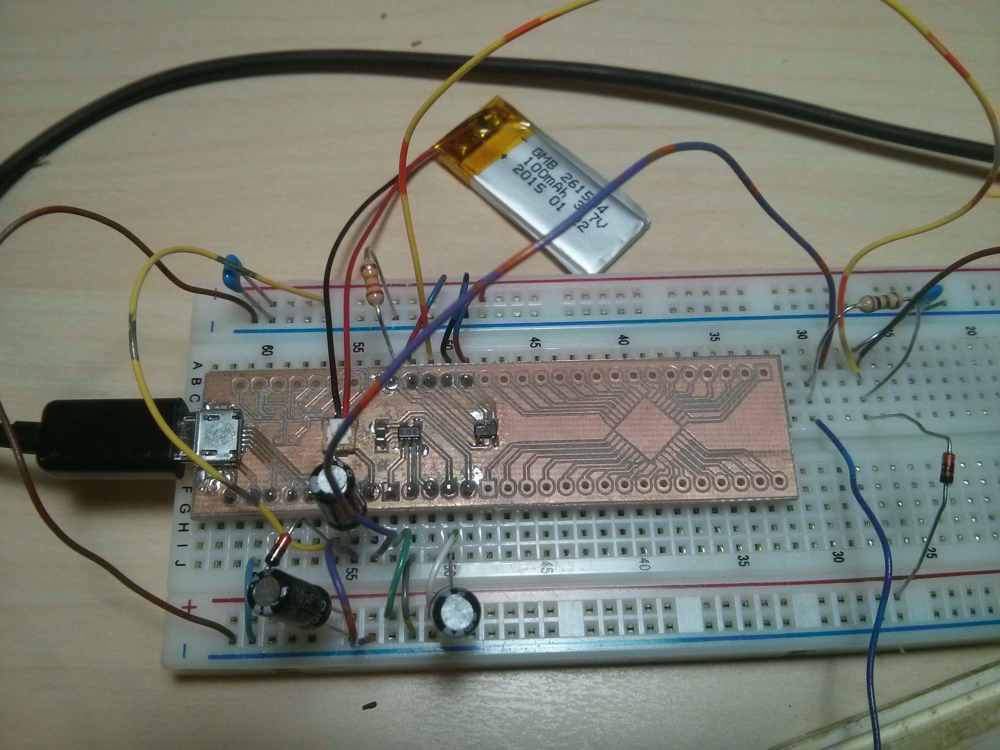
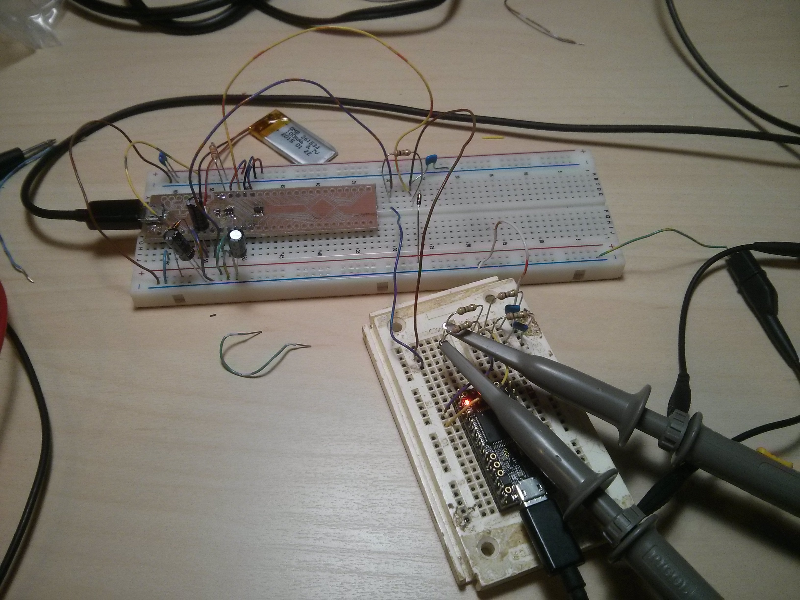

The Problem
===========

I am working on a project that involves a Li-Ion battery charger. I've never built one of these circuits before and I wanted to test the battery over its entire charge-discharge cycle to make sure it wasn't going to burst into flame because I set some resistor wrong. The battery itself is very tiny (100mAH, 2.5mm thick) and is going to be powering an extremely low-power circuit, hopefully over the course of many weeks between charges.

After about 2 days of taking meter measurements every 6 hours or so to see what the voltage level had dropped to, I decided to try to automate this process. I had my trusty Teensy 3.1 lying around, so I thought that it should be pretty simple to turn it into a simple data logger, measuring the voltage at a very slow rate (maybe 1 measurement per 5 seconds). Thus was born the EZDAQ.

**All code for this project is located in the repository at `https\://github.com/kcuzner/ezdaq <https://github.com/kcuzner/ezdaq>`__**

Setting up the Teensy 3.1 ADC
=============================

I've never used the ADC before on the Teensy 3.1. I don't use the Teensy Cores HAL/Arduino Library because I find it more fun to twiddle the bits and write the makefiles myself. Of course, this also means that I don't always get a project working within 30 minutes.

The ADC on the Teensy 3.1 (or the Kinetis MK20DX256) is capable of doing 16-bit conversions at 400-ish ksps. It is also quite complex and can do conversions in many different ways. It is one of the larger and more configurable peripherals on the device, probably rivaled only by the USB module. The module does not come pre-calibrated and requires a calibration cycle to be performed before its accuracy will match that specified in the datasheet. My initialization code is as follows\:

.. code-block:: c

   //Enable ADC0 module
   SIM_SCGC6 |= SIM_SCGC6_ADC0_MASK;

   //Set up conversion precision and clock speed for calibration
   ADC0_CFG1 = ADC_CFG1_MODE(0x1) | ADC_CFG1_ADIV(0x1) | ADC_CFG1_ADICLK(0x3); //12 bit conversion, adc async clock, div by 2 (<3MHz)
   ADC0_CFG2 = ADC_CFG2_ADACKEN_MASK; //enable async clock

   //Enable hardware averaging and set up for calibration
   ADC0_SC3 = ADC_SC3_CAL_MASK | ADC_SC3_AVGS(0x3);
   while (ADC0_SC3 & ADC_SC3_CAL_MASK) { }
   if (ADC0_SC3 & ADC_SC3_CALF_MASK) //calibration failed. Quit now while we're ahead.
       return;
   temp = ADC0_CLP0 + ADC0_CLP1 + ADC0_CLP2 + ADC0_CLP3 + ADC0_CLP4 + ADC0_CLPS;
   temp /= 2;
   temp |= 0x1000;
   ADC0_PG = temp;
   temp = ADC0_CLM0 + ADC0_CLM1 + ADC0_CLM2 + ADC0_CLM3 + ADC0_CLM4 + ADC0_CLMS;
   temp /= 2;
   temp |= 0x1000;
   ADC0_MG = temp;

   //Set clock speed for measurements (no division)
   ADC0_CFG1 = ADC_CFG1_MODE(0x1) | ADC_CFG1_ADICLK(0x3); //12 bit conversion, adc async clock, no divide

Following the recommendations in the datasheet, I selected a clock that would bring the ADC clock speed down to <4MHz and turned on hardware averaging before starting the calibration. The calibration is initiated by setting a flag in ADC0_SC3 and when completed, the calibration results will be found in the several ADC0_CL\* registers. I'm not 100% certain how this calibration works, but I believe what it is doing is computing some values which will trim some value in the `SAR <https://en.wikipedia.org/wiki/Successive_approximation_ADC>`__ logic (probably something in the internal DAC) in order to shift the converted values into spec.

One thing to note is that I did not end up using the 16-bit conversion capability. I was a little rushed and was put off by the fact that I could not get it to use the full 0-65535 dynamic range of a 16-bit result variable. It was more like 0-10000. This made figuring out my "volts-per-value" value a little difficult. However, the 12-bit mode gave me 0-4095 with no problems whatsoever. Perhaps I'll read a little further and figure out what is wrong with the way I was doing the 16-bit conversions, but for now 12 bits is more than sufficient. I'm just measuring some voltages.

Since I planned to measure the voltages coming off a Li-Ion battery, I needed to make sure I could handle the range of 3.0V-4.2V. Most of this is outside the Teensy's ADC range (max is 3.3V), so I had to make myself a resistor divider attenuator (with a parallel capacitor for added stability). It might have been better to use some sort of active circuit, but this is supposed to be a quick and dirty DAQ. I'll talk a little more about handling issues spawning from the use of this resistor divider in the section about the host software.

Quick and dirty USB device-side driver
======================================

For this project I used my device-side USB driver software that I wrote in `this project <http://kevincuzner.com/2014/12/12/teensy-3-1-bare-metal-writing-a-usb-driver/>`__. Since we are gathering data quite slowly, I figured that a simple control transfer should be enough to handle the requisite bandwidth.

.. code-block:: c

   static uint8_t tx_buffer[256];

   /**
    * Endpoint 0 setup handler
    */
   static void usb_endp0_handle_setup(setup_t* packet)
   {
       const descriptor_entry_t* entry;
       const uint8_t* data = NULL;
       uint8_t data_length = 0;
       uint32_t size = 0;
       uint16_t *arryBuf = (uint16_t*)tx_buffer;
       uint8_t i = 0;

       switch(packet->wRequestAndType)
       {
   ...USB Protocol Stuff...
       case 0x01c0: //get adc channel value (wIndex)
           *((uint16_t*)tx_buffer) = adc_get_value(packet->wIndex);
           data = tx_buffer;
           data_length = 2;
           break;
       default:
           goto stall;
       }

       //if we are sent here, we need to send some data
       send:
   ...Send Logic...

       //if we make it here, we are not able to send data and have stalled
       stall:
   ...Stall logic...
   }

I added a control request (0x01) which uses the wIndex (not to be confused with the cleaning product) value to select a channel to read. The host software can now issue a vendor control request 0x01, setting the wIndex value accordingly, and get the raw value last read from a particular analog channel. In order to keep things easy, I labeled the analog channels using the same format as the standard Teensy 3.1 layout. Thus, wIndex 0 corresponds to A0, wIndex 1 corresponds to A1, and so forth. The adc_get_value function reads the last read ADC value for a particular channel. Sampling is done by the ADC continuously, so the USB read doesn't initiate a conversion or anything like that. It just reads what happened on the channel during the most recent conversion.

Host software
=============

Since libusb is easy to use with Python, via PyUSB, I decided to write out the whole thing in Python. Originally I planned on some sort of fancy gui until I realized that it would far simpler just to output a CSV and use MATLAB or Excel to process the data. The software is simple enough that I can just put the entire thing here\:

.. code-block:: python

   #!/usr/bin/env python3

   # Python Host for EZDAQ
   # Kevin Cuzner
   #
   # Requires PyUSB

   import usb.core, usb.util
   import argparse, time, struct

   idVendor = 0x16c0
   idProduct = 0x05dc
   sManufacturer = 'kevincuzner.com'
   sProduct = 'EZDAQ'

   VOLTS_PER = 3.3/4096 # 3.3V reference is being used

   def find_device():
       for dev in usb.core.find(find_all=True, idVendor=idVendor, idProduct=idProduct):
           if usb.util.get_string(dev, dev.iManufacturer) == sManufacturer and \
                   usb.util.get_string(dev, dev.iProduct) == sProduct:
               return dev

   def get_value(dev, channel):
       rt = usb.util.build_request_type(usb.util.CTRL_IN, usb.util.CTRL_TYPE_VENDOR, usb.util.CTRL_RECIPIENT_DEVICE)
       raw_data = dev.ctrl_transfer(rt, 0x01, wIndex=channel, data_or_wLength=256)
       data = struct.unpack('H', raw_data)
       return data[0] * VOLTS_PER;

   def get_values(dev, channels):
       return [get_value(dev, ch) for ch in channels]

   def main():
       # Parse arguments
       parser = argparse.ArgumentParser(description='EZDAQ host software writing values to stdout in CSV format')
       parser.add_argument('-t', '--time', help='Set time between samples', type=float, default=0.5)
       parser.add_argument('-a', '--attenuation', help='Set channel attentuation level', type=float, nargs=2, default=[], action='append', metavar=('CHANNEL', 'ATTENUATION'))
       parser.add_argument('channels', help='Channel number to record', type=int, nargs='+', choices=range(0, 10))
       args = parser.parse_args()

       # Set up attentuation dictionary
       att = args.attenuation if len(args.attenuation) else [[ch, 1] for ch in args.channels]
       att = dict([(l[0], l[1]) for l in att])
       for ch in args.channels:
           if ch not in att:
               att[ch] = 1

       # Perform data logging
       dev = find_device()
       if dev is None:
           raise ValueError('No EZDAQ Found')
       dev.set_configuration()
       print(','.join(['Time']+['Channel ' + str(ch) for ch in args.channels]))
       while True:
           values = get_values(dev, args.channels)
           print(','.join([str(time.time())] + [str(v[1] * (1/att[v[0]])) for v in zip(args.channels, values)]))
           time.sleep(args.time)

   if __name__ == '__main__':
       main()

Basically, I just use the argparse module to take some command line inputs, find the device using PyUSB, and spit out the requested channel values in a CSV format to stdout every so often.

In addition to simply displaying the data, the program also processes the raw ADC values into some useful voltage values. I contemplated doing this on the device, but it was simpler to configure if I didn't have to reflash it every time I wanted to make an adjustment. One thing this lets me do is a sort of calibration using the "attenuation" values that I put into the host. The idea with these values is to compensate for a voltage divider in front of the analog input in order so that I can measure higher voltages, even though the Teensy 3.1 only supports voltages up to 3.3V.

For example, if I plugged my 50%-ish resistor divider on channel A0 into 3.3V, I would run the following command\:

::

   ::

      $ ./ezdaq 0
      Time,Channel 0
      1467771464.9665403,1.7990478515625
      ...

We now have 1.799 for the "voltage" seen at the pin with an attenuation factor of 1. If we divide 1.799 by 3.3 we get 0.545 for our attenuation value. Now we run the following to get our newly calibrated value\:

::

   ::

      $ ./ezdaq -a 0 0.545 0
      Time,Channel 0
      1467771571.2447994,3.301005232
      ...

This process highlights an issue with using standard resistors. Unless the resistors are precision resistors, the values will not ever really match up very well. I used 4 1meg resistors to make two voltage dividers. One of them had about a 46% division and the other was close to 48%. Sure, those seem close, but in this circuit I needed to be accurate to at least 50mV. The difference between 46% and 48% is enough to throw this off. So, when doing something like this with trying to derive an input voltage after using an imprecise voltage divider, some form of calibration is definitely needed.

Conclusion
==========

After hooking everything up and getting everything to run, it was fairly simple for me to take some two-channel measurements\:

::

   $ ./ezdaq -t 5 -a 0 0.465 -a 1 0.477 0 1 > ~/Projects/AVR/the-project/test/charge.csv 

This will dump the output of my program into the charge.csv file (which is measuring the charge cycle on the battery). I will get samples every 5 seconds. Later, I can use this data to make sure my circuit is working properly and observe its behavior over long periods of time. While crude, this quick and dirty DAQ solution works quite well for my purposes.

.. rstblog-settings::
   :title: Quick-n-dirty data acquisition with a Teensy 3.1
   :date: 2016/07/05
   :url: /2016/07/05/quick-n-dirty-data-acquisition-with-a-teensy-3-1