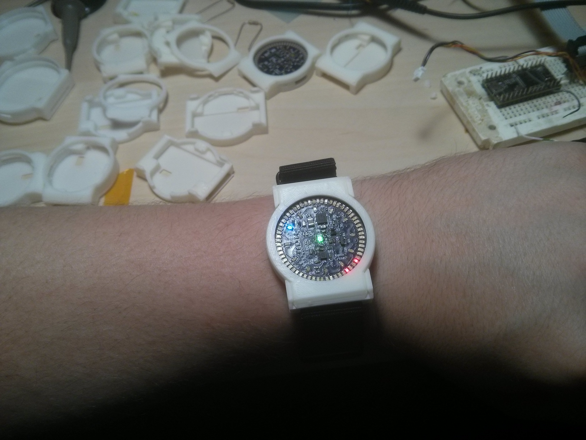
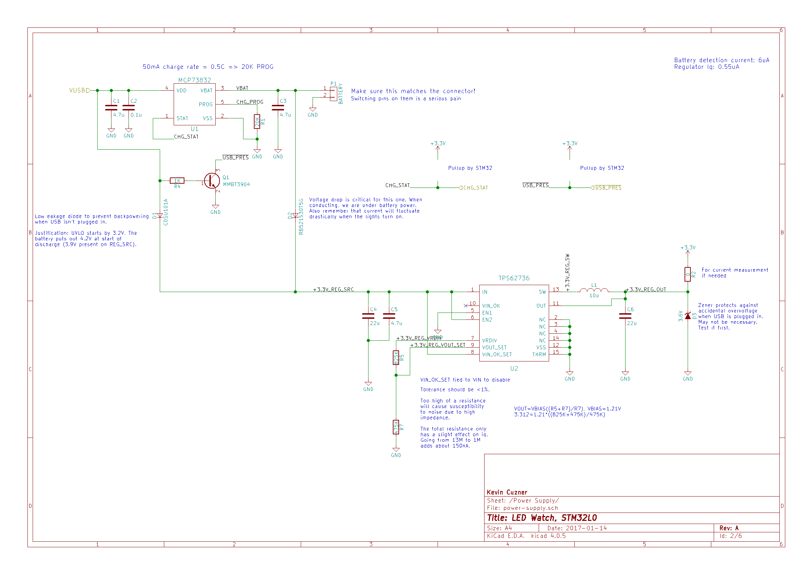
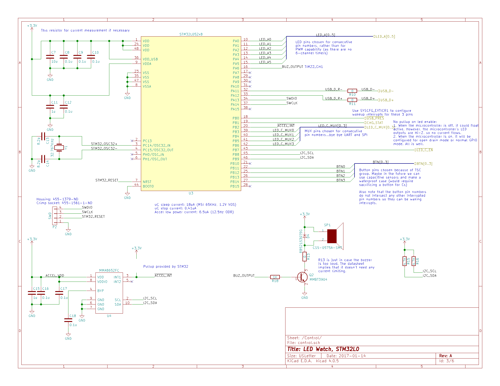
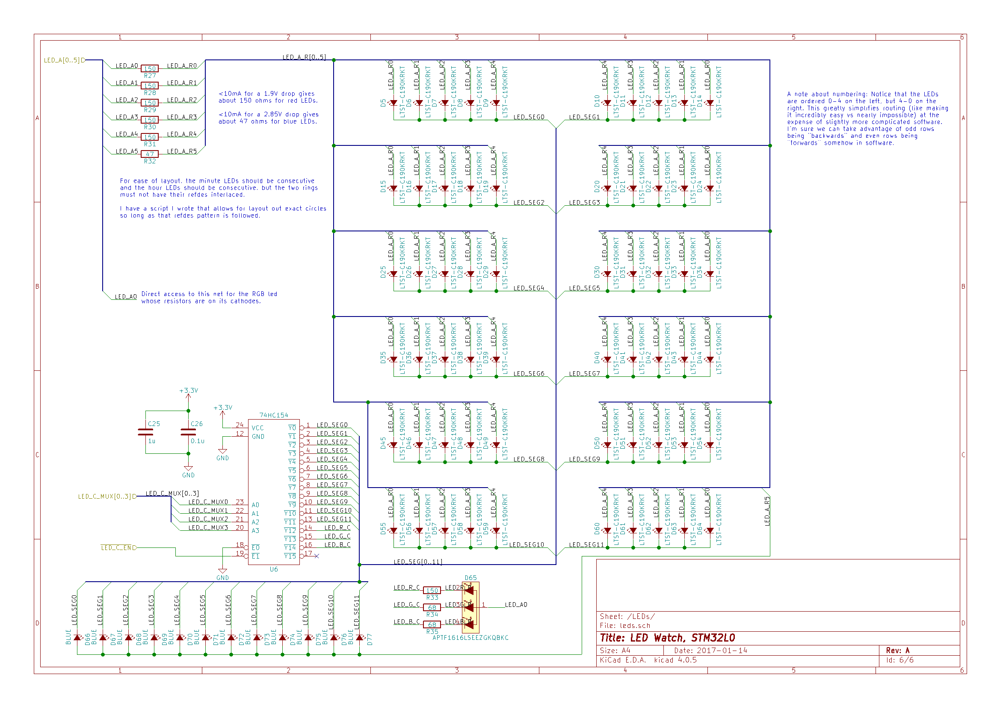
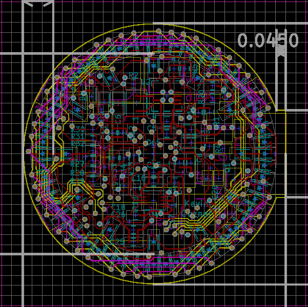

About 2009 I saw an article written by Dr. Paul Pounds in which he detailed a pocketwatch he had designed that fit inside a standard pocketwatch case and used LEDs as the dial. While the article has since disappeared, the `youtube video <https://www.youtube.com/watch?v=lex53AY7Fmo>`__ remains. The wayback machine has a `cached version <https://web.archive.org/web/20160322025932/http://www.eng.yale.edu/pep5/pocket_watch.html>`__ of the page. Anyway, the idea has kind of stuck with me for a while and so a year or so ago I decided that I wanted to build a wristwatch inspired by that idea.

Although the project started out as an AVR project, I decided after my escapades with the STM32 in August that I really wanted to make it an STM32 project, so around November I started making a new design that used the STM32L052C8 ARM Cortex-M0+ ultra-low power USB microcontroller. The basic concept of the design is to mock up an analog watch face using a ring of LEDs for the hours, minutes, and seconds. I found three full rings to be expecting a bit much if I wanted to keep this small, so I ended up using two rings\: One for the hours and another for combined minutes and seconds (the second hand is recognized by the fact that it is "moving" perceptibly).

In this post I'm going to go over my general design, some things I was happy with, and some things that I wasn't happy with. I'll make some follow-up posts for the following topics\:
* `USB on the STM32 <http://kevincuzner.com/2018/01/29/bare-metal-stm32-writing-a-usb-driver/>`__

* `Creating a Human Interface Device <http://kevincuzner.com/2018/02/02/cross-platform-driverless-usb-the-human-interface-device/>`__

* `Writing a USB Bootloader on the STM32L052 <http://kevincuzner.com/2018/06/28/building-a-usb-bootloader-for-an-stm32/>`__

**The complete design files can be found here\:**

`https\://github.com/kcuzner/led-watch <https://github.com/kcuzner/led-watch>`__

  .. image:: IMG_20170415_194157.jpg
   :target: http://kevincuzner.com/wp-content/uploads/2017/04/IMG_20170415_194157.jpg

.. rstblog-break::

There are three main parts to the watch circuit\:
* The power supply and battery charger.

* The microcontroller and accelerometer.

* The display.

The Power Supply & Battery Charger
----------------------------------

The key constraint for the power supply (shown on the right with mistakes, see further down for explanation and fixes) was quiescent current. Last year I did a little experiment with a buck converter I had selected for its small size and low part count. I connected it to my battery and waited to see how long my battery would last (I posted a little about the experiment `here <http://kevincuzner.com/2016/07/05/quick-n-dirty-data-acquisition-with-a-teensy-3-1/>`__) when powering that regulator. It barely lasted a day. This was very disappointing since my expectation was for this thing to last me at least 4-5 days between charges. I looked deeper in the datasheet and saw that the buck controller I had selected actually had a fairly high quiescent current compared to my load. It claimed very high efficiency, but its load was meant to be somewhere in the several hundred milliamps. My load was going to live in the microamp range most of the time and I needed a buck controller that would also have a quiescent current in that same range.

Enter the TPS62736 from TI. I saw this used on another ultra-low-power design that measured radioactivity or something like that. I can't find the original project and I suspect that the files have since disappeared since I had a difficult time finding them last year when I first looked at this. It has an extremely low quiescent current and is 90% efficient at a 10nA output current. It achieves this through various power saving methods, the most public of which is its clever use of polling the voltage set-point divider only once every few milliseconds rather than having it tied directly into the error amplifier like most other integrated buck controllers. The only downside was that it came only in a QFN package and this project was to be hand soldered. However, I really wanted to hit my battery and size target and there were already two other QFN chips lined up for being soldered in this project, so I decided to use it.

The next key component was the Li-Ion battery charger. This was one part that I was a little nervous about since I had never done an integrated battery charger or anything resembling it before and I didn't want this thing bursting into flame on my wrist. For the purpose of charging the battery from USB, I found the MCP73832 by Microchip. It was pretty straightforward to use\: Stick a programming resistor on a pin, feed it around 5V, and it will charge up your battery. I also did an experiment with this chip before using it in my design, leaving it charging a Li-Ion battery for several days. It did so without incident and so I included it in the design.

Now, if you were to look at the schematic you would see that I have several diodes and a transistor in there. The diodes are meant as a diode-auctioneering circuit which effectively disconnects the battery from the regulator when the USB power is present (using the 5V to power the regulator instead). I did this because I wasn't sure how the MCP73832 would behave when charging a battery that was also under load. Better safe than sorry I say. The transistor allows the microcontroller to detect when USB is plugged in and is also where a mistake was made\: I did not connect a resistor between the base and ground to prevent leakage current from turning on the transistor. With the circuit as shown, the transistor is always on since just under 2V is present on the 5V line when the USB is unplugged. I suspect that the reverse leakage comes either through the diode or the battery charger (most likely the charger), but the fix was pretty easy\: Just solder a little resistor between the base and emitter of the transistor.

The Microcontroller & Accelerometer
-----------------------------------

This is one area where the design kept changing. I started out with an ATMega48A, changed it to a Kinetis KL26-series, and settled finally on the STM32L052C8 once I had found that STM32s were obscenely easy to program.

The STM32L0 series is ST's ultra-low-power offering for the STM32 lineup. I believe it is meant to complete with the EFM32 from Silicon Labs. The EFM32 would probably have been the better choice from a strictly current-consumption oriented perspective, but I had already programmed an STM32 before and was confident that I could get all of its peripherals to work. The STM32L052C8 is USB-enabled, has 64K of flash, and many peripherals which made writing the software for this fairly easy. As is my usual practice, I completely ignored ST's provided hardware abstraction library and wrote my own which directly interfaces with the registers. More on that in another post, as it is an adventure of its own.

One interesting feature of the STM32L052C8 is that it has a real-time clock (RTC) which completely ignores all forms of reset except power-on-reset (since obviously it can't run when power is shut off). This means that even if I screw up the programming and reset or hard fault the chip over and over again, the RTC's value is not lost. ST actually provides a list of compatible crystals as well, so I chose one from that list and put it in. A very ready-made design.

The accelerometer is the "standard" MMA8652 from Freescale/NXP which is found on breakout boards all over the DIY community. My only qualm about choosing this part was that was an extraordinarily small 2mm x 2mm DFN and had some fairly strict layout guidances, with even the solder mask having an appreciable impact on how the chip would sit on the board. It was at this point that I realized that this, combined with the power supply chip, would basically require me to use solder paste and a hot air gun for reflow. I had built a previous design that used thermal vias to an exposed pad on the secondary side of the board to solder QFNs by heating them through the board, but that technique would not work on this design since it was going to be quite tight.

Another component to note here is the buzzer. This was a bit of an afterthought, `but its a small, 5mm, magnetic buzzer <https://www.digikey.com/products/en?x=0&y=0&lang=en&site=us&keywords=102-2201-1-ND>`__. I figured that I might want the watch to beep for an alarm of something if the software ever got to that point, so why not add a tiny buzzer to it. This part worked more or less as designed, though it did cause the 3.3V rail to drop a half volt or so when it was turned on at 1KHz (mitigated by changing the duty cycle to like 2%..adds some high frequency overtones to the sound, but works just fine and minimizes the perturbation).

The only real mistake here was in the USB part\: I did not fully read the microcontroller datasheet before ordering parts and I neglected to change the series terminators to 33 ohms. I ended up needing to use some extra 47 ohm resistors I happened to get for the LED part of the design as terminators. They work well enough and the signal integrity looks ok (the traces are like an inch anyway).

The LEDs
--------

As the main part of the watch that people see, the LEDs needed to be bright enough and work well while still maintaining my target PCB form factor. This part of the design presented some unexpected challenges, some realized while I was still designing, and some realized after I had assembled everything and was scratching my head wondering why things didn't work as planned.

The LEDs I chose are all 0603 form factor, including the central RGB LED which is 0606. This allowed me to create a board about 32mm in diameter, if I went to four layers and sacrificed the edges of the internal layers for some additional routing. Considering how tiny the board was going to be, paying twice as much per square inch of the board wasn't a huge deal.

The first challenge I am going to talk about is routing. There are 73 LEDs in total, with 60 on the outer "minutes/seconds" ring, 12 on an inner hour ring, and a central RGB LED. They are multiplexed using a 74HC154 line decoder (16 active-low output lines) On the right you can see that I arranged the LEDs in a circle (look for the footprint silksceen in cyan; I turned off pads and copper pours so that the inner layers could be seen) around the edge, with very little clearance. This allowed for the smallest board space possible (the inner pads of the LEDs are as close as I could make them while maintaining solderability), at the expense of routing area. The ring LEDs are arranged in the circuit into 12 groups of 6 LEDs apiece\: 5 minute LEDs and the one hour LED. This means that if I were to arrange these LEDs in a circle, I would need to have 6 concentric ring traces running around the edge of the board with 72 connection traces running off from those rings to the individual LEDs. That created a problem\: I didn't have room for the 72 connection traces if I wanted to have a microcontroller living in the middle of the board. After thinking about it for a while, I actually reversed the order of the odd-numbered minute LED segments. So, the wiring pattern for the LEDs goes 0-1-2-3-4-4-3-2-1-0-0-1-2-3-4... rather than the more expected 0-1-2-3-4-0-1-2-3-4-0-1-2-3-4... pattern. It's more clear in the schematic how this works (look at the ordering of the net names on the LEDs). This allowed me to wire the whole thing without needing to create connection traces crosscrossing everywhere. Instead, I could use two routing layers to make two sets of 6 concentric hexagonal routing shapes which both go around the board and end very near the pad of the LED they are destined for. I used the internal layers for these hexagons, leaving the external layers for the component pads and support circuitry. The cost of this decision was in software, as it requires the bitmap for the odd-numbered segments to be reversed in order to display a pattern on the outer ring.

Now, I can hear the PCB design crowd screaming at me for having used internal plane layers as routing layers. I've just introduced a whole ton of parasitic inductance in the PCB by disrupting the return current path. However, I believe that I can justify the decision with a couple points\: Firstly, I only used the edge of the board. There is still a ground plane in the central area where most of the digital stuff happens. Secondly, I did not introduce any large plane breaks except on layer 2 (yellow, +3.3V). Because I mounted the microcontroller on Layer 4, it and most other digital switching components on that layer are adjacent to the fairly unbroken ground plane of Layer 3 (as long as parts and traces don't go near the edge). I restricted the components that live on Layer 1 (red) adjacent to the Layer 2 breaks to capacitors and LED-related resistor components. The only digital part that lives on the top layer is the accelerometer and the +3.3V plane beneath it is unbroken. While the LED traces certainly have added inductance, there are a *lot* of capacitors on this board for its size and I think the additional inductance introduced on those traces will not cause a problem (at least they don't seem to be causing any problems so far).

The other main challenge was realized after I had already assembled the board and was puzzling over a particular issue\: Battery life. The watch only got about 3 hours of life on a charge. That was two orders of magnitude less than I had expected. I ended up doing some dissection and noticed that the watch was consuming 30mA *in sleep mode*! The display was turned off and the microcontroller was in stop mode, so I was quite confused. After doing a poor-man's "bisect" of the software with my multimeter and commenting out parts of the code, I isolated the excessive current draw to the LED portion of the code. With the LEDs disabled, the whole circuit drew about a milliamp off the 3.3V rail when sleeping. Poking around further, I found that I could avoid the high current consumption as long as I didn't activate the GPIOs driving the 6 LED pins. I narrowed it down further when I found that I only had to not activate the hour GPIO. I could also keep current consumption down by setting that pin high whenever the mux was disabled (effectively putting 0V across the LED). Clearly, the blue LEDs had some sort of reverse leakage problem. I re-read the datasheet and saw a note that I had missed\: "*Not designed for reverse operation*" in the spot where there would normally be a reverse leakage current value. I had been so focused on finding a blue LED with a low enough forward voltage that I hadn't looked at that value in the datasheet.

To fix the LED problem, I had to reconsider the way I was turning off the LEDs. Whenever I put the microcontroller to sleep I would disable the 74HC154 which drives the 12 LED segments. This causes its outputs to all go high. Depending on which segment was active at the time that the microcontroller went to sleep, the hour anode output from the microcontroller had an 11 in 12 chance in being low which would introduce a reverse voltage across those blue LEDs and make the microcontroller sink that reverse current. The simplest fix was to simply set that pin high during the process of disabling the 74HC154. After that change, the current consumption during sleep dropped from 30mA to 0.47mA! Another, better, fix is to use the pin mode settings to change the pins to input mode when the LEDs need to be off and change them back to output-high when the LEDs need to be on. This effectively would leave the LEDs floating when they are off and should have the same effect. I haven't tested this yet, however.

Conclusion
==========

This project was especially satisfying to me because I managed to actually bring an idea to fruition that had been floating around my mind for many years. I learned a *lot* from this project, especially about USB, and I'll eventually be making some posts about those aspects. I haven't even talked about the mechanical aspect of the project and 3D printing experiments, so I'll get to that eventually as well.

In summary, I was happy that even with my errors the watch worked fairly well. There were zero problems programming the microcontroller and parts that I was reluctant about (I'm talking about you, DFN packages) soldered well and worked just fine. I still need to improve my diligence in part selection, however, as the whole blue LED fiasco could have been avoided by just reading a datasheet thoroughly.

Oh, and the parts cost? ~$50. Not bad, though it makes a very impractical timepiece as it's fragile and not water or splash resistant in the slightest.

.. rstblog-settings::
   :title: The LED Wristwatch: A (more or less) completed project!
   :date: 2017/04/18
   :url: /2017/04/18/the-led-wristwatch-a-more-or-less-completed-project