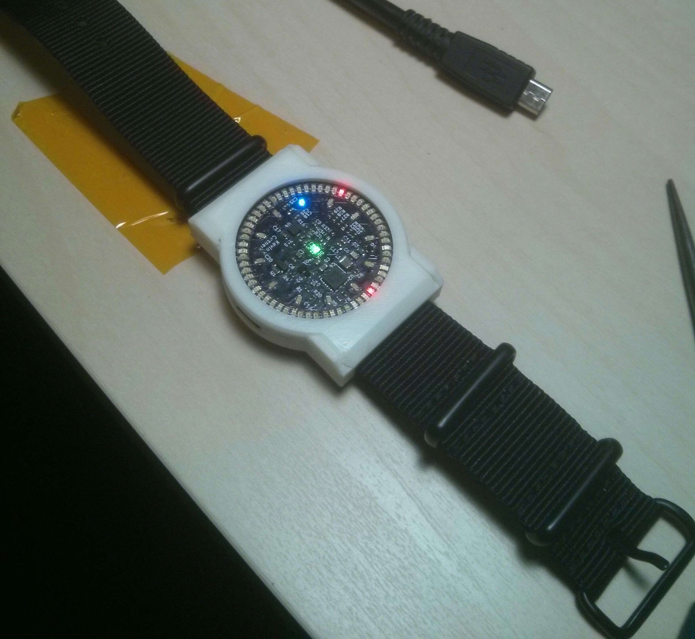

.. rstblog-settings::
   :title: Bare metal STM32: Writing a USB driver
   :date: 2018/01/29
   :url: /2018/01/29/bare-metal-stm32-writing-a-usb-driver

A couple years ago I wrote `a post <http://kevincuzner.com/2014/12/12/teensy-3-1-bare-metal-writing-a-usb-driver/>`__ about writing a bare metal USB driver for the Teensy 3.1, which uses Freescale Kinetis K20 microcontroller. Over the past couple years I've switched over to instead using the STM32 series of microcontrollers since they are cheaper to program the "right" way (the dirt-cheap STLink v2 enables that). I almost always prefer to use the microcontroller IC by itself, rather than building around a development kit since I find that to be much more interesting.

One of my recent (or not so recent) projects was an `LED Wristwatch <http://kevincuzner.com/2017/04/18/the-led-wristwatch-a-more-or-less-completed-project/>`__ which utilized an STM32L052. This microcontroller is optimized for low power, but contains a USB peripheral which I used for talking to the wristwatch from my PC, both for setting the time and for reflashing the firmware. This was one of my first hobby projects where I designed something without any prior breadboarding (beyond the battery charger circuit). The USB and such was all rather "cross your fingers and hope it works" and it just so happened to work without a problem.

In this post I'm going to only cover a small portion of what I learned from the USB portion of the watch. There will be a further followup on making the watch show up as a HID Device and writing a USB bootloader.

**Example code for this post can be found here\:** 

`**https\://github.com/kcuzner/led-watch** <https://github.com/kcuzner/led-watch>`__

(mainly in common/src/usb.c and common/include/usb.h)

My objective here is to walk quickly through the operation of the USB Peripheral, specifically the Packet Memory Area, then talk a bit about how the USB Peripheral does transfers, and move on to how I structured my code to abstract the USB packetizing logic away from the application.

.. rstblog-break::

My code is by no means good. In fact, I believe some of it might be wrong (specifically my treatment of the PMA on the STM32L052). My intent here is to show how to interact with the STM32 USB peripheral and one way to get started writing your own HAL around it, rather than relying on others' software. Feel free to leave a comment with your thoughts.

Contents
========

`The STM32 USB Peripheral <stm32-usb-peripheral>`__
`The Packet Memory Area <pma>`__

`PMA in the STM32F103 <pma-stm32f103>`__

`PMA in the STM32L052 <pma-stm32l052>`__

`Allocating variables in the PMA <pma-variables>`__

`Handling transfers <handling-transfers>`__

`The "hook pattern", callbacks based on weak links <hook-pattern>`__

`My USB Peripheral API <peripheral-api>`__
`Transfers <transfers>`__

`Where to go from here <where-to>`__

`Conclusion <conclusion>`__

.. _stm32-usb-peripheral:

The STM32 USB Peripheral
========================

As I have recommended in my previous post, please visit `http\://www.usbmadesimple.co.uk/index.html <http://www.usbmadesimple.co.uk/index.html>`__ to get up to speed on how USB works.

Next, you will need to locate the appropriate datasheets. As I've discovered is very common for microcontrollers, you need the following\:

* The family reference manual (very very long document, >1000 pages usually)

* The datasheet (much shorter document, maybe 40 pages)

ST makes these easy to find on their website. For the USB peripheral, there's a lot of common ground with the Kinetis peripheral, but there are some key differences. Here's a rundown of the features of the STM32 peripheral\:

* The USB Peripheral manages transferring data to and from the host for up to 8 bi-directional endpoints (16 single-direction).

* A separate clock is used for the USB Peripheral, independent of the main processor and bus clock. On the STM32L052, one of the really cool things about this is that it is able to use the internal oscillator to generate a proper 48MHz USB clock by locking to the Start of Frame handshake from the host. This allows crystal-less USB operation! Very cool.

* The STM32 has a dedicated separate SRAM that is shared by dual-porting between the main memory bus and the USB peripheral through some arbitration logic, which I'll refer to as the **Arbiter** . This contrasts with the K20 peripheral which required that a portion of the microcontroller's general SRAM be allocated by the program for the peripheral to use and flag bits be used to inform the peripheral of who "owns" some portion of the memory. I'm not sure which way I like better, as they have their pros and cons. This area of memory in the STM32 is called the **Packet Memory Area**  or **PMA** . This memory is used to copy packets to and from the host. I'm going to talk about this at length later, since it has some special considerations.

* A table located in the PMA (location in the PMA is at the user's discretion) points to all the other buffers in the PMA which are actually used for transferring data. This is called the "**Buffer Descriptor Table** " (**BDT** ) and functions in a very similar way to the BDT on the K20.

* There is a single interrupt for handling all events associated with the USB peripheral. Same as the K20.

* The USB peripheral keeps track of the endpoint status. An endpoint may be disabled, stalled, NAK'ing, or ready. The peripheral handles all the host-side handshaking, along with the Data0 and Data1 toggling when sending data. Basically, you can point the peripheral toward an area in the packet memory, set the endpoint status to be ready (Valid) and away you go.

.. _pma:

The Packet Memory Area
----------------------

In my opinion, this is the most complex part of the peripheral and something that I spent many hours reading about. Sadly, the documentation is quite sparse on this point and isn't always in the most straightforward locations inside the reference manual and datasheet.

The STM32 provides some amount of general SRAM that is used by the application program. This is arranged in 32-bit words accessible by word, halfword and byte, with some restrictions, through the main memory bus. The packet memory area is completely separate from the general SRAM and instead contains 16-bit words. As I mentioned earlier, it can be accessed concurrently by the main memory bus and the USB Peripheral by way of an Arbiter which moderates between the two without needing the program to intervene or be aware of the USB Peripheral accessing the PMA. There are some differences in how this is implemented between the STM32F1 and the STM32L0\:

.. _pma-stm32f103:

For the STM32F103\:
~~~~~~~~~~~~~~~~~~~

The PMA is arranged as 256 16-bit words (512 bytes of PMA SRAM), but from the processor bus it must be accessed in a 32-bit aligned fashion. I think this is most easily understood with the following diagram\:

::

   ADDR+OFFSET: |  0x0  |  0x1  |  0x2  |  0x3  |
   -------------|-------|-------|-------|-------|
     0x40006000 | 0x000 | 0x001 | ----- | ----- |
     0x40006004 | 0x002 | 0x003 | ----- | ----- |
     0x40006008 | 0x004 | 0x005 | ----- | ----- |
     0x4000600C | 0x006 | 0x007 | ----- | ----- |
     0x40006010 | 0x008 | 0x009 | ----- | ----- |
     ....
     0x400063F8 | 0x1FC | 0x1FD | ----- | ----- |
     0x400063FC | 0x1FE | 0x1FF | ----- | ----- |

Each 16-bit word of PMA memory utilizes all four bytes of a 32-bit-aligned address, even though the value itself only uses the first two bytes. This means that even though there are only 512 bytes of PMA SRAM, it takes up 1KB of address space (0x3FF = 256).

This also requires some special considerations when accessing memory. Since accesses can only happen by 32-bit word and only two bytes of that word are actually used, it is not suitable for use as general memory. If you want a nice byte buffer that your application can work with, you'll need to allocate that in general SRAM. When you're ready to send it over USB then it can be copied into the PMA with its weird access alignment rules. I ended up making the following methods to help with that (note\: USB_PMAADDR is defined to 0x40006000 elsewhere, which is the start of the PMA from the perspective of the main memory bus)\:

.. code-block:: c

   /**
    * Minimally sized data type for things in the PMA
    */
   typedef uint16_t PMAWord;

   /**
    * Translates a PMA pointer into a local address for the USB peripheral
    */
   #define USB_LOCAL_ADDR(PMAPTR) (uint32_t)((uint32_t)(PMAPTR) - USB_PMAADDR)
   /**
    * Translates a USB local address into a PMA pointer
    */
   #define PMA_ADDR_FROM_USB_LOCAL(LOCALPTR) (PMAWord *)((LOCALPTR) + USB_PMAADDR)
   /**
    * Translates a PMA pointer into an application memory pointer
    * Note: This is safe for pointer arithmetic and will map correctly
    */
   #define APPLICATION_ADDR(PMAPTR) (uint32_t *)((USB_LOCAL_ADDR(PMAPTR))*2 + USB_PMAADDR)
   /**
    * Translates the size of a PMA symbol into its size as seen in application memory
    */
   #define APPLICATION_SIZEOF(SYMB) (sizeof(SYMB)*2)

   /**
    * Performs a copy into a region of memory into a the PMA
    *
    * src: Pointer to source located in normal memory
    * pmaDest: Pointer to destination located in PMA
    * len: Length in bytes to copy
    */
   static void usb_pma_copy_in(void *src, PMAWord *pmaDest, uint16_t len)
   {
       //note the sizes of the following
       PMAWord *wordSrc = (PMAWord *)src;
       uint32_t *appDest = APPLICATION_ADDR(pmaDest);

       for (uint16_t i = 0; i < len; i += sizeof(PMAWord)) //we move along by word
       {
           *appDest = *wordSrc;
           appDest++; //move along by four bytes to next PMA word
           wordSrc++; //move along by one word
       }
   }

   /**
    * Performs a copy from the PMA into a region of memory
    *
    * pmaSrc: Pointer to source located in PMA
    * dest: Pointer to destination located in normal memory
    * len: Length in bytes to copy
    */
   static void usb_pma_copy_out(PMAWord *pmaSrc, void *dest, uint16_t len)
   {
       //note the size of the following
       uint32_t *appSrc = APPLICATION_ADDR(pmaSrc);
       PMAWord *wordDest = (PMAWord *)dest;

       for (uint16_t i = 0; i < len; i += sizeof(PMAWord)) //we move along by word
       {
           *wordDest = *appSrc;
           wordDest++; //move along by one word
           appSrc++; //move along by four bytes to the next PMA word
       }
   }

The main thing to get out of these is that the usb_pma_copy functions treat the buffer as a bunch of 16-bit values and perform all accesses 32-bit aligned. My implementation **is naive and highly insecure.**  Buffers are subject to some restrictions that will cause interesting behavior if they aren't followed\:

* **Naive\:** Buffers in general SRAM must be aligned on a 16-bit boundary. Since I copy everything by half-word by casting the void\* pointers into uint16_t\*, the compiler will optimize that and assume that void \*dest or void \*src are indeed half-word aligned. If they aren't halfword aligned, a hardfault will result since the load/store half-word instruction (LDRH, STRH) will fail. Because I didn't want to have to cast everything to a uint16_t\* or abuse the union keyword, I had to create the following and put it before every declaration of a buffer in general SRAM\:

.. code-block:: c

   #define USB_DATA_ALIGN __attribute__ ((aligned(2)))

* **Insecure\:**  The copy functions will actually copy an extra byte to or from general SRAM if the buffer length is odd. This is very insecure, but the hole should only be visible from the application side since I'm required to allocate things on 16-bit boundaries inside the PMA, even if the buffer length is odd (so the USB peripheral couldn't copy in or out of the adjacent buffer if an odd number of bytes were transferred). In fact, the USB peripheral will respect odd/excessive lengths and stop writing/reading if it reaches the end of a buffer in the PMA. So, the reach of this insecurity should be fairly small beyond copying an extra byte to where it doesn't belong.

.. _pma-stm32l052:

For the STM32L052\:
~~~~~~~~~~~~~~~~~~~

This microcontroller's PMA is actually far simpler than the STM32F1's. It is arranged as 512 16-bit words (so its twice the size) and also does not require access on 32-bit boundaries. The methods I defined for the STM32L103 are now instead\:

.. code-block:: c

   /**
    * Minimally sized data type for things in the PMA
    */
   typedef uint16_t PMAWord;

   /**
    * Translates a PMA pointer into a local address for the USB peripheral
    */
   #define USB_LOCAL_ADDR(PMAPTR) (uint16_t)((uint32_t)(PMAPTR) - USB_PMAADDR)
   /**
    * Translates a USB local address into a PMA pointer
    */
   #define PMA_ADDR_FROM_USB_LOCAL(LOCALPTR) (PMAWord *)((LOCALPTR) + USB_PMAADDR)

   /**
    * Placeholder for address translation between PMA space and Application space.
    * Unused on the STM32L0
    */
   #define APPLICATION_ADDR(PMAPTR) (uint16_t *)(PMAPTR)

   /**
    * Placeholder for size translation between PMA space and application space.
    * Unused on the STM32L0
    */
   #define APPLICATION_SIZEOF(S) (sizeof(S))

   /**
    * Performs a copy from a region of memory into a the PMA
    *
    * src: Pointer to source located in normal memory
    * pmaDest: Pointer to destination located in PMA
    * len: Length in bytes to copy
    */
   static void usb_pma_copy_in(void *src, PMAWord *pmaDest, uint16_t len)
   {
       //note the sizes of the following
       PMAWord *wordSrc = (PMAWord *)src;
       uint16_t *appDest = APPLICATION_ADDR(pmaDest);

       for (uint16_t i = 0; i < len; i += sizeof(PMAWord)) //we move along by word
       {
           *appDest = *wordSrc;
           appDest++; //move along by two bytes to next PMA word
           wordSrc++; //move along by one word
       }
   }

   /**
    * Performs a copy from the PMA into a region of memory
    *
    * pmaSrc: Pointer to source located in PMA
    * dest: Pointer to destination located in normal memory
    * len: Length in bytes to copy
    */
   static void usb_pma_copy_out(PMAWord *pmaSrc, void *dest, uint16_t len)
   {
       //note the size of the following
       uint16_t *appSrc = APPLICATION_ADDR(pmaSrc);
       PMAWord *wordDest = (PMAWord *)dest;

       for (uint16_t i = 0; i < len; i += sizeof(PMAWord)) //we move along by word
       {
           *wordDest = *appSrc;
           wordDest++; //move along by one word
           appSrc++; //move along by two bytes to the next PMA word
       }
   }

The main difference here is that you'll see that the appSrc and appDest pointers are now 16-bit aligned rather than 32-bit aligned. This is possible because the PMA on the STM32L052 is accessible using 16-bit accesses from the user application side of the Arbiter, whereas the STM32F103's PMA could only be accessed 32 bits at a time from the application side. There's still some unclear aspects of why the above works on the STM32L052 since the datasheet seems to imply that it is accessed in nearly the same way as the STM32F103 (it allocates 2KB of space at 0x40006000 for 512 16-bit words). Nonetheless, it seems to work. If someone could point me in the right direction for understanding this, I would appreciate it.

Still naive, still insecure, and still requiring 16-bit aligned buffers in the general SRAM. Just about the only upside is the simplicity of access.

.. _pma-variables:

Allocating variables in the PMA
~~~~~~~~~~~~~~~~~~~~~~~~~~~~~~~

One fun thing I decided to do was use the GCC linker to manage static allocations in the PMA (continue reading for why I wanted to do this). By way of background, the GCC linker uses a file called a "linker script" to determine how to arrange the contents of a program in the final binary. The program is arranged into various sections (called things like "text", "bss", "data", "rodata", etc) during compilation. During the linking phase, the linker script will instruct the linker to take those sections and place them at specific memory addresses.

My linker script for the STM32L052 has the following MEMORY declaration (in the github repo it is somewhat different, but that's because of my bootloader among other things)\:

::

   MEMORY
   {
       FLASH (RX) : ORIGIN = 0x08000000, LENGTH = 64K
       RAM (W!RX)  : ORIGIN = 0x20000000, LENGTH = 8K
       PMA (W)  : ORIGIN = 0x40006000, LENGTH = 1024 /* 512 x 16bit */
   }

You can see that I said there's a segment of memory called FLASH that is 64K long living at 0x08000000, another segment I called RAM living at 0x20000000 which is 8K long, and another section called PMA living at 0x40006000 which is 1K long (it may actually be 2K long in 32-bit address space, see my blurb about my doubts on my understanding of the STM32L052's PMA structure).

I'm not going to copy in my whole linker script, but to add support for allocating variables into the PMA I added the following to my SECTIONS\:

::

   SECTIONS
   {
   ...
       /* USB/CAN Packet Memory Area (PMA) */
       .pma :
       {
           _pma_start = .; /* Start of PMA in real memory space */
           . = ALIGN(2);
           *(.pma)
           *(.pma*)
           . = ALIGN(2);
           _pma_end = .; /* End of PMA in PMA space */
       } > PMA
   ...
   }

I declared a segment called ".pma" which puts everything inside any sections starting with ".pma" inside the memory region "PMA", which starts at 0x40006000.

Now, as for why I wanted to do this, take a look at this fun variable declaration\:

.. code-block:: c

   #define PMA_SECTION ".pma,\"aw\",%nobits//" //a bit of a hack to prevent .pma from being programmed
   #define _PMA __attribute__((section (PMA_SECTION), aligned(2))) //everything needs to be 2-byte aligned
   #define _PMA_BDT __attribute__((section (PMA_SECTION), used, aligned(8))) //buffer descriptors need to be 8-byte aligned

   /**
    * Buffer table located in packet memory. This table contains structures which
    * describe the buffer locations for the 8 endpoints in packet memory.
    */
   static USBBufferDescriptor _PMA_BDT bt[8];

This creates a variable in the ".pma" section called "bt". Now, there are a few things to note about this variable\:

* I had to do a small hack. Look at the contents of "PMA_SECTION". If I didn't put "aw,%nobits" after the name of the section, the binary file would actually attempt to program the contents of the PMA when I flashed the microcontroller. This isn't an issue for Intel HEX files since the data address can jump around, but my STM32 programming process uses straight binary blobs. The blob would actually contain the several-Gb segment between the end of the flash (somewhere in the 0x08000000's) and the beginning of the PMA (0x40006000). That was obviously a problem, so I needed to prevent the linker from thinking it needed to program things in the .pma segment. The simplest way was with this hack.

* We actually can't assign or read from "bt" directly, since some translation may be needed. On the STM32L052 no translation is needed, but on the STM32F103 we have to realign the address in accordance with its strange 32-bit 16-bit memory layout. This is done through the APPLICATION_ADDR macro which was defined in an earlier code block when talking about copying to and from the PMA. Here's an example\:

.. code-block:: c

   if (!*APPLICATION_ADDR(&bt[endpoint].tx_addr))
   {
       *APPLICATION_ADDR(&bt[endpoint].tx_addr) = USB_LOCAL_ADDR(usb_allocate_pma_buffer(packetSize));
   }

When accessing PMA variables, the address of anything that the program needs to access (such as "bt[endpoint].tx_addr") needs to be translated into an address space compatible with the user programs-side of the Arbiter before it is dereferenced (note that the \* is *after* we have translated the address).

Another thing to note is that when the USB peripheral gets an address to something in the PMA, it does not need the 0x40006000 offset. In fact, from its perspective address 0x00000000 is the start of the PMA. This means that when we want to point the USB to the BDT (that's what the bt variable is), we have to do the following\:

.. code-block:: c

   //BDT lives at the beginning of packet memory (see linker script)
   USB->BTABLE = USB_LOCAL_ADDR(bt);

All the USB_LOCAL_ADDR macro does is subtract 0x40006000 from the address of whatever is passed.

In conclusion, by creating this .pma section I have enabled using the pointer math features already present in C for accessing the PMA. The amount of pointer math I have to do with macros is fairly limited compared to manually computing an address inside the PMA and dereferencing it. So far this seems like a safer way to do this, though I think it can still be improved.

.. _handling-transfers:

Handling Transfers
------------------

Since USB transfers are all host-initiated, the device must tell the USB Peripheral where it can load/store transfer data and then wait. Every endpoint has a register called the "EPnR" in the USB peripheral which has the following fields\:

* Correct transfer received flag

* Receive data toggle bit (for resetting the DATA0 and DATA1 status)

* The receiver status (Disabled, Stall, NAK, or Valid).

* Whether or not a setup transaction was just received.

* The endpoint type (Bulk, Control, Iso, or Interrupt).

* An endpoint "kind" flag. This only has meaning if the endpoint type is Bulk or Control.

* Correct transfer transmitted flag

* Transmit data toggle bit (for resetting the DATA0 and DATA1 status)

* The transmitter status (Disabled, Stall, NAK, or Valid).

* The endpoint address. Although only there are only 8 EPnR registers, the endpoints can respond to any of the valid USB endpoint addresses (in reality 32 address, if you consider the direction to be part of the address).

The main point I want to hit on with this register is the Status fields. The USB Peripheral is fairly involved with handshaking and so the status of the transmitter or receiver must be set correctly\:

* If a transmitter or receiver is Disabled, then the endpoint doesn't handshake for that endpoint. It is off. If the endpoint is unidirectional, then the direction that the endpoint is not should be set to "disabled"

* If a transmitter or receiver is set to Stall, it will perform a STALL handshake whenever the host tries to access that endpoint. This is meant to indicate to the host that the device has reached an invalid configuration or been used improperly.

* If a transmitter or receiver is set to NAK, it will perform a NAK handshake whenver the host tries to access that endpoint. This signals to the host that the endpoint is not ready yet and the host should try the transfer again later.

* If a transmitter or receiver is set to Valid, it will complete the transaction when the host asks for it. If the host wants to send data (and the transmit status is Valid), it will start transferring data into the PMA. If the host wants to receive data (and the receive status is Valid), it will start transferring data out of the PMA. Once this is completed, the appropriate "correct transfer" flag will be set and an interrupt will be generated.

This is where the PMA ties in. The USB Peripheral uses the Buffer Descriptor Table to look up the addresses of the buffers in the PMA. There are 8 entries in the BDT (one for each endpoint) and they have the following structure (assuming the Kind bit is set to 0...the Kind bit can enable double buffering, which is beyond the scope of this post)\:

.. code-block:: c

   //single ended buffer descriptor
   typedef struct __attribute__((packed)) {
       PMAWord tx_addr;
       PMAWord tx_count;
       PMAWord rx_addr;
       PMAWord rx_count;
   } USBBufferDescriptor;

The struct is packed, meaning that each of those PMAWords is right next to the other one. Since PMAWord is actually uint16_t, we can see that the tx_addr and rx_addr fields are not large enough to be pointing to something in the global memory. They are in fact pointing to locations inside the PMA as well. The BDT is just an array, consisting of 8 of these 16-byte structures.

After an endpoint is initialized and the user requests a transfer on that endpoint, I do the following once for transmit and once for receive, as needed\:

* Dynamically allocate a buffer in the PMA (more on this next).

* Set the address and count in the BDT to point to the new buffer.

The buffers used for transferring data in the PMA I dynamically allocate by using the symbol "_pma_end" which was defined by the linker script. When the USB device is reset, I move a "break" to point to the address of _pma_end. When the user application initializes an endpoint, I take the break and move it forward some bytes to reserve that space in the PMA for that endpoint's buffer. Here's the code\:

.. code-block:: c

   /**
    * Start of the wide open free packet memory area, provided by the linker script
    */
   extern PMAWord _pma_end;

   /**
    * Current memory break in PMA space (note that the pointer itself it is stored
    * in normal memory).
    *
    * On usb reset all packet buffers are considered deallocated and this resets
    * back to the _pma_end address. This is a uint16_t because all address in
    * PMA must be 2-byte aligned if they are to be used in an endpoint buffer.
    */
   static PMAWord *pma_break;

   /**
    * Dynamically allocates a buffer from the PMA
    * len: Buffer length in bytes
    *
    * Returns PMA buffer address
    */
   static PMAWord *usb_allocate_pma_buffer(uint16_t len)
   {
       PMAWord *buffer = pma_break;

       //move the break, ensuring that the next buffer doesn't collide with this one
       len = (len + 1) / sizeof(PMAWord); //divide len by sizeof(PMAWord), rounding up (should be optimized to a right shift)
       pma_break += len; //mmm pointer arithmetic (pma_break is the appropriate size to advance the break correctly)

       return buffer;
   }

   /**
    * Called during interrupt for a usb reset
    */
   static void usb_reset(void)
   {
   ...
       //All packet buffers are now deallocated and considered invalid. All endpoints statuses are reset.
       memset(APPLICATION_ADDR(bt), 0, APPLICATION_SIZEOF(bt));
       pma_break = &_pma_end;
       if (!pma_break)
           pma_break++; //we use the assumption that 0 = none = invalid all over
   ...
   }

The _pma_end symbol was defined by the statement "_pma_end = .;" in the linker script earlier. It is accessed here by declaring it as an extern PMAWord (uint16_t) so that the compiler knows that it is 2-byte aligned (due to the ". = ALIGN(2)" immediately beforehand). By accessing its address, we can find out where the end of static allocations (like "bt") in the PMA is. After this address, we can use the rest of the memory in the PMA as we please at runtime, just like a simple heap. When usb_allocate_pma_buffer is called, the pma_break variable is moved foward.

Now, to tie it all together, here's what happens when we initialize an endpoint\:

.. code-block:: c

   void usb_endpoint_setup(uint8_t endpoint, uint8_t address, uint16_t size, USBEndpointType type, USBTransferFlags flags)
   {
       if (endpoint > 7 || type > USB_ENDPOINT_INTERRUPT)
           return; //protect against tomfoolery

       endpoint_status[endpoint].size = size;
       endpoint_status[endpoint].flags = flags;
       USB_ENDPOINT_REGISTER(endpoint) = (type == USB_ENDPOINT_BULK ? USB_EP_BULK :
               type == USB_ENDPOINT_CONTROL ? USB_EP_CONTROL :
               USB_EP_INTERRUPT) |
           (address & 0xF);
   }

   void usb_endpoint_send(uint8_t endpoint, void *buf, uint16_t len)
   {
   ...
       uint16_t packetSize = endpoint_status[endpoint].size;

       //check for PMA buffer presence, allocate if needed
       if (!*APPLICATION_ADDR(&bt[endpoint].tx_addr))
       {
           *APPLICATION_ADDR(&bt[endpoint].tx_addr) = USB_LOCAL_ADDR(usb_allocate_pma_buffer(packetSize));
       }
   ...
   }

   ...receive looks similar, but more on that later...

When the application sets up an endpoint, I store the requested size of the endpoint in the endpoint_status struct (which we'll see more of later). When a transfer is actually requested (by calling usb_endpoint_send in this snippet) the code checks to see if the BDT has been configured yet (since the BDT lives at address 0, it knows that if tx_addr is 0 then it hasn't been configured). If it hasn't it allocates a new buffer by calling usb_allocate_pma_buffer with the size value stored when the endpoint was set up by the application.

.. _hook-pattern:

The "hook pattern", callbacks based on weak links
=================================================

At this point in the post, we are starting to see more and more of how I've built this API. My goals were as follows\:

* I wanted to have a codebase for the USB peripheral that I didn't need to modify in order to implement new device types. One thing I really disliked about the Teensy's USB driver was that there were a bunch of #define's inside the method that handled setup transactions. I wanted to be able to separate out my application's code from the USB driver's code. Maybe someday I could even just distribute it to myself as a static library and have my applications link to it.

* I wanted it to be asynchronous, with callbacks. However, callbacks are fairly expensive when they're dynamic. Storing function pointers eats memory and calling function pointers eats instruction space. In addition, setting dynamic function pointers means that there has to be a setup step which means another place where I could induce a hard fault if I forgot to set up the pointer and then invoked an uninitialized function pointer. I wanted to have the USB driver call back into my application without needing to remember to send it a bunch of function pointers during startup at runtime.

To that end, I decided to use what I call the "hook" pattern because of how I named my methods. This a very common pattern in embedded programming because it is so lightweight and I've decided to use it here.

In my USB driver header file I declared the following\:

.. code-block:: c

   /**
    * Hook function implemented by the application which is called when a
    * non-standard setup request arrives on endpoint zero.
    *
    * setup: Setup packet received
    * nextTransfer: Filled during this function call with any data for the next state
    *
    * Returns whether to continue with the control pipeline or stall
    */
   USBControlResult hook_usb_handle_setup_request(USBSetupPacket const *setup, USBTransferData *nextTransfer);

   /**
    * Hook function implemented by the application which is called when the status
    * stage of a setup request is completed on endpoint zero.
    *
    * setup: Setup packet received
    */
   void hook_usb_control_complete(USBSetupPacket const *setup);

   /**
    * Hook function implemented by the application which is called when the
    * USB peripheral has been reset
    */
   void hook_usb_reset(void);

   /**
    * Hook function implemented by the application which is called when an SOF is
    * received (1ms intervals from host)
    */
   void hook_usb_sof(void);

   /**
    * Hook function implemented by the application which is called when the host
    * sets a configuration. The configuration index is passed.
    */
   void hook_usb_set_configuration(uint16_t configuration);

   /**
    * Hook function implemented by the application which is called when the host
    * sets an [alternate] interface for the current configuration.
    */
   void hook_usb_set_interface(uint16_t interface);

   /**
    * Hook function implemented by the application which is called when a setup
    * token has been received. Setup tokens will always be processed, regardless
    * of NAK or STALL status.
    */
   void hook_usb_endpoint_setup(uint8_t endpoint, USBSetupPacket const *setup);

   /**
    * Hook function implemented by the application which is called when data has
    * been received into the latest buffer set up by usb_endpoint_receive.
    */
   void hook_usb_endpoint_received(uint8_t endpoint, void *buf, uint16_t len);

   /**
    * Hook function implemented by the application which is called when data has
    * been sent from the latest buffer set up by usb_endpoint_send.
    */
   void hook_usb_endpoint_sent(uint8_t endpoint, void *buf, uint16_t len);

And in my main USB C file I have the following\:

.. code-block:: c

   USBControlResult __attribute__ ((weak)) hook_usb_handle_setup_request(USBSetupPacket const *setup, USBTransferData *nextTransfer)
   {
       return USB_CTL_STALL; //default: Stall on an unhandled request
   }
   void __attribute__ ((weak)) hook_usb_control_complete(USBSetupPacket const *setup) { }
   void __attribute__ ((weak)) hook_usb_reset(void) { }
   void __attribute__ ((weak)) hook_usb_sof(void) { }
   void __attribute__ ((weak)) hook_usb_set_configuration(uint16_t configuration) { }
   void __attribute__ ((weak)) hook_usb_set_interface(uint16_t interface) { }
   void __attribute__ ((weak)) hook_usb_endpoint_setup(uint8_t endpoint, USBSetupPacket const *setup) { }
   void __attribute__ ((weak)) hook_usb_endpoint_received(uint8_t endpoint, void *buf, uint16_t len) { }
   void __attribute__ ((weak)) hook_usb_endpoint_sent(uint8_t endpoint, void *buf, uint16_t len) { }

Notice these are `weak symbols <https://en.wikipedia.org/wiki/Weak_symbol>`__. Elsewhere in the application I can redefine these and that implementation will take precedence over these. When events happen during the USB interrupt, these functions will be called to inform the application and get its response. In most cases, no return result is needed except in the case of the hook_usb_handle_setup_request, which is used for extending the endpoint 0 setup request handler.

If someone knows the real name of this pattern, please enlighten me.

.. _peripheral-api:

My USB Peripheral API
=====================

Most of this section is taken from the code in common/usb.c and common/usb.h

Ok, so here's how I organized this API. My idea was to present an interface consisting entirely of byte buffers to the application program, keeping the knowledge of packetizing and the PMA isolated to within the driver. Facing the application side, here's how it looks (read the comments for notes about how the functions are used)\:

.. code-block:: c

   #define USB_CONTROL_ENDPOINT_SIZE 64

   /**
    * Endpoint types passed to the setup function
    */
   typedef enum { USB_ENDPOINT_BULK, USB_ENDPOINT_CONTROL, USB_ENDPOINT_INTERRUPT } USBEndpointType;

   /**
    * Direction of a USB transfer from the host perspective
    */
   typedef enum { USB_HOST_IN = 1 << 0, USB_HOST_OUT = 1 << 1 } USBDirection;

   /**
    * Flags for usb transfers for some USB-specific settings
    *
    * USB_FLAGS_NOZLP: This replaces ZLP-based transfer endings with exact length
    * transfer endings. For transmit, this merely stops ZLPs from being sent at
    * the end of a transfer with a length which is a multiple of the endpoint size.
    * For receive, this disables the ability for the endpoint to finish receiving
    * into a buffer in the event that packets an exact multiple of the endpoint
    * size are received. For example, if a 64 byte endpoint is set up to receive
    * 128 bytes and the host only sends 64 bytes, the endpoint will not complete
    * the reception until the next packet is received, whatever the length. This
    * flag is meant specifically for USB classes where the expected transfer size
    * is known in advance. In this case, the application must implement some sort
    * of synchronization to avoid issues stemming from host-side hiccups.
    */
   typedef enum { USB_FLAGS_NONE = 0, USB_FLAGS_NOZLP = 1 << 0 } USBTransferFlags;

   /**
    * Setup packet type definition
    */
   typedef struct {
       union {
           uint16_t wRequestAndType;
           struct {
               uint8_t bmRequestType;
               uint8_t bRequest;
           };
       };
       uint16_t wValue;
       uint16_t wIndex;
       uint16_t wLength;
   } USBSetupPacket;

   /**
    * Basic data needed to initiate a transfer
    */
   typedef struct {
       void *addr;
       uint16_t len;
   } USBTransferData;

   /**
    * Result of a control setup request handler
    */
   typedef enum { USB_CTL_OK, USB_CTL_STALL } USBControlResult;

   #define USB_REQ_DIR_IN   (1 << 7)
   #define USB_REQ_DIR_OUT  (0 << 7)
   #define USB_REQ_TYPE_STD (0 << 5)
   #define USB_REQ_TYPE_CLS (1 << 5)
   #define USB_REQ_TYPE_VND (2 << 5)
   #define USB_REQ_RCP_DEV  (0)
   #define USB_REQ_RCP_IFACE (1)
   #define USB_REQ_RCP_ENDP  (2)
   #define USB_REQ_RCP_OTHER (3)

   #define USB_REQ(REQUEST, TYPE) (uint16_t)(((REQUEST) << 8) | ((TYPE) & 0xFF))

   /**
    * Initializes the USB peripheral. Before calling this, the USB divider
    * must be set appropriately
    */
   void usb_init(void);

   /**
    * Enables the usb peripheral
    */
   void usb_enable(void);

   /**
    * Disables the USB peripheral
    */
   void usb_disable(void);

   /**
    * Enables an endpoint
    *
    * Notes about size: The size must conform the the following constraints to not
    * cause unexpected behavior interacting with the STM32 hardware (i.e. conflicting
    * unexpectedly with descriptor definitions of endpoints):
    * - It must be no greater than 512
    * - If greater than 62, it must be a multiple of 32
    * - If less than or equal to 62, it must be even
    * Size is merely the packet size. Data actually sent and received does not need
    * to conform to these parameters. If the endpoint is to be used only as a bulk
    * IN endpoint (i.e. transmitting only), these constraints do not apply so long
    * as the size conforms to the USB specification itself.
    *
    * endpoint: Endpoint to set up
    * address: Endpoint address
    * size: Endpoint maximum packet size
    * type: Endpoint type
    * flags: Endpoint transfer flags
    */
   void usb_endpoint_setup(uint8_t endpoint, uint8_t address, uint16_t size, USBEndpointType type, USBTransferFlags flags);

   /**
    * Sets up or disables send operations from the passed buffer. A send operation
    * is started when the host sends an IN token. The host will continue sending
    * IN tokens until it receives all data (dentoed by sending either a packet
    * less than the endpoint size or a zero length packet, in the case where len
    * is an exact multiple of the endpoint size).
    *
    * endpoint: Endpoint to set up
    * buf: Buffer to send from or NULL if transmit operations are to be disabled
    * len: Length of the buffer
    */
   void usb_endpoint_send(uint8_t endpoint, void *buf, uint16_t len);

   /**
    * Sets up or disables receive operations into the passed buffer. A receive
    * operation is started when the host sends either an OUT or SETUP token and
    * is completed when the host sends a packet less than the endpoint size or
    * sends a zero length packet.
    *
    * endpoint: Endpoint to set up
    * buf: Buffer to receive into or NULL if receive operations are to be disabled
    * len: Length of the buffer
    */
   void usb_endpoint_receive(uint8_t endpoint, void *buf, uint16_t len);

   /**
    * Places an endpoint in a stalled state, which persists until usb_endpoint_send
    * or usb_endpoint_receive is called. Note that setup packets can still be
    * received.
    *
    * endpoint: Endpoint to stall
    * direction: Direction to stall
    */
   void usb_endpoint_stall(uint8_t endpoint, USBDirection direction);

Much of the guts of these methods are fairly self-explanatory if you read through the source (common/src/usb.c). The part that really makes this API work for me is in how it does transfers.

 

.. _transfers:

Transfers
---------

I'm just going to go through the transmit sequence, since the receive works in a similar manner. A transfer is initiated when the user calls usb_endpoint_send, passing a buffer with a length. The sequence is going to go as follows\:

#. Use an internal structure to store a pointer to the buffer along with its length.

#. Call a subroutine that queues up the next USB packet to send from the buffer

   #. Determine if transmission is finished. If so, return.

   #. Allocate a packet buffer in the PMA if needed. The buffer will be endpointSize long, which is the packet size configured when the user set up the endpoint. This is usually 8 or 64 for low and full speed peripherals, respectively.

   #. Determine how much of the user buffer remains to be sent after this packet.

   #. If this packet is shorter than the endpoint length or this packet is a ZLP (zero-length packet, used in Bulk transmissions if the bytes to be sent are an exact multiple of the endpointSize so that the host can know when all bytes are sent), change the internal structure to show that we are done.

   #. Otherwise, increment our position in the user buffer

   #. In all cases, toggle the EPnR bits to make the transmit endpoint Valid so that a packet is sent.

#. The user subroutine exits at this point.

#. During an interrupt, if a packet is transmitted for the endpoint that the user sent a packet on, call the same subroutine from earlier.

#. During the same interrupt, if the internal structure indicates that the last packet has been sent, call the hook_usb_endpoint_sent function to inform the user application that the whole buffer has been transmitted.

The supporting code for this is as follows\:

.. code-block:: c

   /**
    * Endpoint status, tracked here to enable easy sending and receiving through
    * USB by the application program.
    *
    * size: Endpoint packet size in PMA (buffer table contains PMA buffer addresses)
    * flags: Flags for this endpoint (such as class-specific disabling of ZLPs)
    *
    * tx_buf: Start of transmit buffer located in main memory
    * tx_pos: Current transmit position within the buffer or zero if transmission is finished
    * tx_len: Transmit buffer length in bytes
    *
    * rx_buf: Start of receive buffer located in main memory
    * rx_pos: Current receive position within the buffer
    * rx_len: Receive buffer length
    *
    * last_setup: Last received setup packet for this endpoint
    */
   typedef struct {
       uint16_t size; //endpoint packet size
       USBTransferFlags flags; //flags for this endpoint
       void *tx_buf; //transmit buffer located in main memory
       void *tx_pos; //next transmit position in the buffer or zero if done
       uint16_t tx_len; //transmit buffer length
       void *rx_buf; //receive buffer located in main memory
       void *rx_pos; //next transmit position in the buffer or zero if done
       uint16_t rx_len; //receive buffer length
       USBSetupPacket last_setup; //last setup packet received by this endpoint (oh man what a waste of RAM, good thing its only 8 bytes)
   } USBEndpointStatus;

   typedef enum { USB_TOK_ANY, USB_TOK_SETUP, USB_TOK_IN, USB_TOK_OUT, USB_TOK_RESET } USBToken;

   typedef enum { USB_RX_WORKING, USB_RX_DONE = 1 << 0, USB_RX_SETUP = 1 << 1 } USBRXStatus;

   /**
    * Sets the status bits to the appropriate value, preserving non-toggle fields
    *
    * endpoint: Endpoint register to modify
    * status: Desired value of status bits (i.e. USB_EP_TX_DIS, USB_EP_RX_STALL, etc)
    * tx_rx_mask: Mask indicating which bits are being modified (USB_EPTX_STAT or USB_EPRX_STAT)
    */
   static inline void usb_set_endpoint_status(uint8_t endpoint, uint32_t status, uint32_t tx_rx_mask)
   {
       uint32_t val = USB_ENDPOINT_REGISTER(endpoint);
       USB_ENDPOINT_REGISTER(endpoint) = (val ^ (status & tx_rx_mask)) & (USB_EPREG_MASK | tx_rx_mask);
   }

   void usb_endpoint_send(uint8_t endpoint, void *buf, uint16_t len)
   {
       //TODO: Race condition here since usb_endpoint_send_next_packet is called during ISRs.
       if (buf)
       {
           endpoint_status[endpoint].tx_buf = buf;
           endpoint_status[endpoint].tx_len = len;
           endpoint_status[endpoint].tx_pos = buf;
           usb_endpoint_send_next_packet(endpoint);
       }
       else
       {
           endpoint_status[endpoint].tx_pos = 0;
           usb_set_endpoint_status(endpoint, USB_EP_TX_DIS, USB_EPTX_STAT);
       }
   }

   /**
    * Sends the next packet for the passed endpoint. If there is no remaining data
    * to send, no operation occurs.
    *
    * endpoint: Endpoint to send a packet on
    */
   static void usb_endpoint_send_next_packet(uint8_t endpoint)
   {
       uint16_t packetSize = endpoint_status[endpoint].size;

       //is transmission finished (or never started)?
       if (!endpoint_status[endpoint].tx_pos || !packetSize)
           return;

       //if we get this far, we have something to transmit, even if its nothing

       //check for PMA buffer presence, allocate if needed
       if (!*APPLICATION_ADDR(&bt[endpoint].tx_addr))
       {
           *APPLICATION_ADDR(&bt[endpoint].tx_addr) = USB_LOCAL_ADDR(usb_allocate_pma_buffer(packetSize));
       }

       //determine actual packet length, capped at the packet size
       uint16_t completedLength = endpoint_status[endpoint].tx_pos - endpoint_status[endpoint].tx_buf;
       uint16_t len = endpoint_status[endpoint].tx_len - completedLength;
       if (len > packetSize)
           len = packetSize;

       //copy to PMA tx buffer
       uint16_t localBufAddr = *APPLICATION_ADDR(&bt[endpoint].tx_addr);
       usb_pma_copy_in(endpoint_status[endpoint].tx_pos, PMA_ADDR_FROM_USB_LOCAL(localBufAddr), len);

       //set count to actual packet length
       *APPLICATION_ADDR(&bt[endpoint].tx_count) = len;

       //move tx_pos
       endpoint_status[endpoint].tx_pos += len;

       //There are now three cases:
       // 1. We still have bytes to send
       // 2. We have sent all bytes and len == packetSize
       // 3. We have sent all bytes and len != packetSize
       //
       //Case 1 obviously needs another packet. Case 2 needs a zero length packet.
       //Case 3 should result in no further packets and the application being
       //notified once the packet being queued here is completed.
       //
       //Responses:
       // 1. We add len to tx_pos. On the next completed IN token, this function
       //    will be called again.
       // 2. We add len to tx_pos. On the next completed IN token, this function
       //    will be called again. A zero length packet will then be produced.
       //    Since len will not equal packetSize at that point, Response 3 will
       //    happen.
       // 3. We now set tx_pos to zero. On the next completed IN token, the
       //    application can be notified. Further IN tokens will result in a NAK
       //    condition which will prevent repeated notifications. Further calls to
       //    this function will result in no operation until usb_endpoint_send is
       //    called again.
       //
       //Exceptions:
       // - Certain classes (such as HID) do not normally send ZLPs, so the
       //   case 3 logic is supplemented by the condition that if the NOZLP
       //   flag is set, the len == packetSize, and completedLength + len
       //   >= tx_len.
       //
       if (len != packetSize ||
               ((endpoint_status[endpoint].flags & USB_FLAGS_NOZLP) && len == packetSize && (len + completedLength >= endpoint_status[endpoint].tx_len)))
       {
           endpoint_status[endpoint].tx_pos = 0;
       }
       else
       {
           endpoint_status[endpoint].tx_pos += len;
       }

       //Inform the endpoint that the packet is ready.
       usb_set_endpoint_status(endpoint, USB_EP_TX_VALID, USB_EPTX_STAT);
   }

   void USB_IRQHandler(void)
   {
       volatile uint16_t stat = USB->ISTR;
    
   ...

       while ((stat = USB->ISTR) & USB_ISTR_CTR)
       {
           uint8_t endpoint = stat & USB_ISTR_EP_ID;
           uint16_t val = USB_ENDPOINT_REGISTER(endpoint);

           if (val & USB_EP_CTR_RX)
           {
   ...
           }

           if (val & USB_EP_CTR_TX)
           {
               usb_endpoint_send_next_packet(endpoint);
               USB_ENDPOINT_REGISTER(endpoint) = val & USB_EPREG_MASK & ~USB_EP_CTR_TX;
               if (!endpoint_status[endpoint].tx_pos)
               {
                   if (endpoint)
                   {
                       hook_usb_endpoint_sent(endpoint, endpoint_status[endpoint].tx_buf, endpoint_status[endpoint].tx_len);
                   }
                   else
                   {
                       //endpoint 0 IN complete
                       usb_handle_endp0(USB_TOK_IN);
                   }
               }
           }
       }
   }

A few things to note\:

* During the interrupt handler, you'll notice a while loop. Internally, the USB Peripheral will actually queue up all the endpoints that have events pending. My "USB_ENDPOINT_REGISTER(endpoint) = val & USB_EPREG_MASK & ~USB_EP_CTR_TX" statement acknowledges the event so that the next time USB->ISTR is read it reflects the next endpoint that needs servicing.

* I don't have any protection against modifying endpoint_status during application code and during ISRs. For the moment I depend on the application to interlock this and ensure that usb_endpoint_send won't be called at a point that it could be interrupted by the USB Peripheral completing a packet on the same endpoint that usb_endpoint_send is being called for.

 

.. _where-to:

Where to go from here
=====================

Clearly, I haven't shown all of the pieces and that's because copying and pasting 900 lines of code isn't that useful. Instead, I wanted to pick out the highlights of managing the PMA and abstracting away the USB packetizing logic from the application.

Using this framework, it should be fairly simple to implement different types of USB devices or even composite USB devices. There's a couple parts that still aren't fully where I want them to be, however\:

* USB Descriptors. I really don't have a good way to make these extensible. For now, they're literally just a byte array declared as extern in the usb header and implemented by the user's application. Manually modifying byte arrays is just not maintainable, but I haven't yet developed a better version (I at one point looked into writing some kind of python xml interpreter that could generate the descriptors, but I ended up just doing it the old byte way because I wanted to get the show on the road and have fun programming my watch.

* Compatibility with an RTOS. It would be so cool if instead of passing flags around with the hook functions I could just call a function and wait on it in a task, just like the normal read and write methods you find in mainstream OS's.

.. _conclusion:

Conclusion
==========

Wow that was long. TLDR of people who look at this will be rampant and that's fine. The point here was describe how I ended up building my device-side driver so that I could easily extend it without needing to modify too many files while still managing to save code space.

I've posted this hoping its useful to someone, even with all its shortcomings. I love doing this kind of stuff and writing a HAL for the USB peripheral is one of my favorite parts of getting started on a new microcontroller. If you have any comments or questions, leave them down below and I'll do my best to respond.