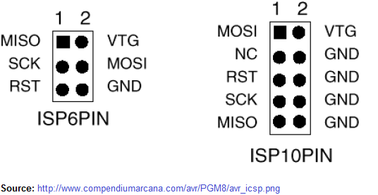
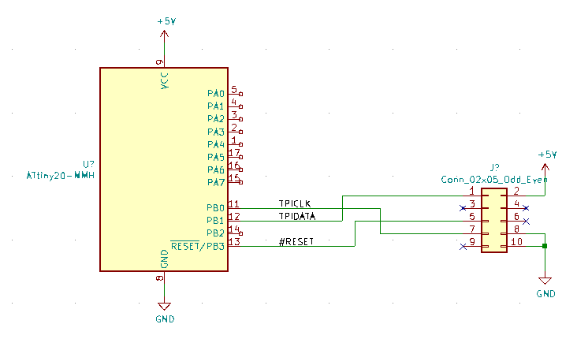
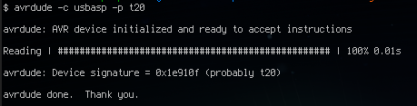
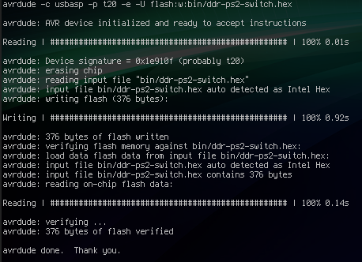

.. rstblog-settings::
   :title: AVR  TPI Programming With usbasp For Dummies
   :date: 2020/11/08
   :url: /2020/11/08/avr-tpi-programming-with-usbasp-for-dummies

There is an odd famine of information about this particular subject available in text form. If you google "usbasp tpi" and things like it, you'll find posts on the avr forums filled with incorrect information and schematics. This post is an attempt to remedy this.

I intend to show exactly the following, no more and no less\:

#. What is TPI?

#. How to reprogram your usbasp to be capable of TPI.

#. How to wire up a TPI-only microcontroller (such as the ATTiny20) to the usbasp's ISP interface.

#. Why you might pick one of these newer devices, rather than sticking with the tried-and-true ISP AVRs.

.. rstblog-break::

What is TPI?
============

TPI is the Tiny Programming Interface found on "somewhat newer" AVR microcontrollers (i.e. made in the last decade or so). There is yet a newer one which has shown up on AVRs post-Microchip acquisition (UPDI) which isn't very publicly documented, but there are utilities like `pyupdi <https://github.com/mraardvark/pyupdi>`__ which aim to support that interface without a programmer.

TPI is quite a bit smaller than the older ISP interface. Rather than looking like an SPI port, it has just three lines\:

* #RESET\: Just the same as before, the reset pin is used to control whether or not the interface is active.

* TPIDATA\: This the bidirectional data line. Unlike ISP, all data is sent on this single line.

* TPICLK\: Clock line.

The timing of these three lines is described in the part datasheets and isn't complex. It is fairly slow, but since the devices that have TPI don't usually have much program flash, it doesn't really make a difference. The logical details on how the interface works are also documented in the part datasheets, but that logic has already made its way into avrdude.

How to reprogram your usbasp to be capable of TPI
=================================================

If you're like me, you bought your USBASP a decade ago from ebay. It likely has very old firmware which isn't capable of TPI programming just yet. Even the "new" usbasps found on ebay have very old firmware. So, you'll need to update the firmware to the newest version (from 2011!!!!) which gave TPI support. There are a few guides on this process, but one text-based one can be found here\: `https\://blog.podkalicki.com/how-to-update-avr-usbasp-firmware-to-latest-version/ <https://blog.podkalicki.com/how-to-update-avr-usbasp-firmware-to-latest-version/>`__

I'll summarize here what you need to do\:

#. Buy a second usbasp. One will be the programmer, and one will be the target that is going to become TPI capable.

#. Download the latest firmware from Thomas Fischl's website\: `https\://www.fischl.de/usbasp/ <https://www.fischl.de/usbasp/>`__

#. Switch the programming jumper on the target by shorting the appropriate header (sometimes labeled JP1, sometimes labeled JP2). It's a two-pin jumper and is NOT the target voltage jumper, nor the "slow clock" jumper.

#. Connect the programmer USB to the PC. Don't connect the target to the PC.

#. Connect the two USBASPs together using the 10-pin ISP ribbon cable.

#. Use avrdude to program the downloaded firmware (be sure to choose the correct hex file for the atmega used on the target programmer).

I want to focus this guide mostly on actually hooking up TPI on a schematic level, so I don't have pictures or anything else here.

How to wire up a TPI-only AVR
=============================

This should be easy to find information on, but it really isn't for some reason. Here's the basics\:

* Connect #RESET to the ISP connector's #RESET

* Connect TPIDATA to the ISP connector's MOSI

* Connect TPICLK to the ISP connector's CLK

* Ensure the AVR is running at 5V. **This is important.**  See later for some tips and tricks I have for getting around this restriction if the rest of your circuit is 3.3V only.

That's it really. However, some details would probably be useful. The pinout of the standard usbasp ISP headers are shown on the right (note\: VTG = VCC at Target, so it's the programmer-supplied voltage).

I used an ATTiny20 in my design, so I have mine wired up like this (note that I tend to leave pins 4 and 6 disconnected since on some programmers they are disconnected)\:

Aside from the connections, the next thing to worry about is that 5V connection. This isn't 2011 anymore and voltages are getting lower and lower. However, flash still requires upwards of 12V to program properly (gotta get those electrons to jump!) and a charge pump that works at 3.3V is 2x or 4x larger than one that needs 5V. So, it makes sense to me that the designers of the ATTiny20 would have made that tradeoff and required a programming voltage of 5V (4.5V minimum, but you should really use 5V) rather than trying to fit a giant charge pump on an already highly-opmized die.

So, you need to program at 5V, but your circuit uses different voltages. Here are some tips I have for resolving this situation\:

* Can your circuit actually run at 5V? All the ICs I picked in my particular design worked at both 3.3V and 5V. So I have two sources for the board power\: the main connector that goes off to the rest of the system (3.3V) and the ISP programming cable (5V). I know that I'll never have both of those plugged in at the same time, so it works for me.

* Think about having the microcontroller live on a separate power rail and use a switch (physical or solid state) to swap between the main board power and the ISP power.

  * Consider a solid state switch. These are quite cheap and small. Here's digikey's complete list\: `https\://www.digikey.com/en/products/filter/pmic-power-distribution-switches-load-drivers/726 <https://www.digikey.com/en/products/filter/pmic-power-distribution-switches-load-drivers/726>`__

  * Be sure to consider the pins going to the other devices on your board. When the microcontroller isn't in reset, it may drive 5V out to the other components. Either build in some logic at program startup so that if you know you're about to program the microcontroller you don't drive the pins (such as wiring the control pins for the switches into the microcontroller as well), or consider using a level translator or something.

* I consider level translators a last resort. They take up space, power, and add (often unnecessary) cost. It's usually far simpler to use clever power supply sequencing or find 5V tolerant logic chips.

  * Consider that many buffer ICs (especially those from TI) have 5V-tolerant inputs and will output at their VCC, which may be lower than their input. They're not a dedicated level translator, but may work well enough.

  * Also consider using tri-state logic. Many tristate drivers can handle voltages on their output pin higher than their VCC. That's a mini level-translator too.

  * Don't just use current limiting resistors on your microcontroller outputs. Sure, it might work today, but you're dumping current through the ESD protection diodes of the chip you're driving and that's not usually a recommended case. Especially if it's a cheap chip from a cheap vendor (ST, the Shenzen Market, etc), they may have not extensively tested the chip against latch-up in those conditions.

If you've got everything wired up properly and the voltage levels are correct, you can run avrdude and get the following beautiful greeting message\:

And if you're even more lucky, reflashing will work too!

Why you might pick a TPI-only AVR
=================================

While I was researching using TPI with my usbasp, I came across a post where someone said something along the lines of "why waste your money on a 6-pin microncontroller? Just use <insert older AVR here>". Despite the obvious downside of needing to use a new programming interface, I think there is one niche where these cannot be beat\:

The TPI-only AVRs are BY FAR the cheapest "name brand" microcontrollers you can buy. Between these and the PIC10 family, there is nothing cheaper until you start looking at some chinese suppliers (there's a $0.03-in-single-quantity microcontroller that has become somewhat popular). I chose the ATTiny20 for my project because **it was even cheaper than a couple discrete single gate ICs** . I needed to do some OR-ing logic which I would have normally accomplished with discrete parts. Each of those in single quantity is like $0.25 and I would have needed at least 4 or 5. The ATTiny20 I picked was **$0.53** . It was cheaper to use a microcontroller than discrete logic gates! What a world we live in.

The older ISP AVRs (especially ATMega8 and friends) are losing relevance in the market when faced with pressure from the ARM Cortex-M based microcontrollers. They not only have better peripherals generally, but they also require both less power and have better tooling (compiler, standard programming tools, etc) than the equivalent AVRs. I would never pick an ATMega328 for a new product unless I had to use an existing binary or something. Even in my personal projects, I strongly prefer ARM Cortex-M microcontrollers because they're easier to program and debug without requiring expensive single-vendor hardware.

Conclusion
==========

The intention in this post was to communicate how to program TPI-based AVRs without too much hassle using the usbasp. If I've got a detail missing, something wrong, or this post helped you out, feel free to drop a comment!